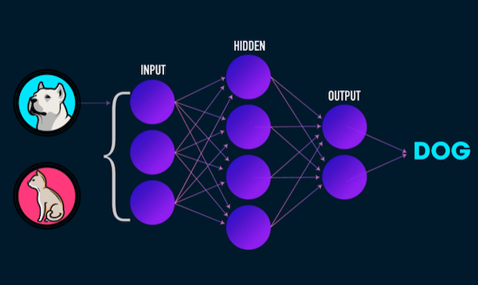

# Javascript Machine Learning

This repository maintains a reading list of Machine Learning technologies, algorithms and API's focused on javascript

 

# Contents

- [Quick Introduction with javascript examples](./introduction.md)
- [Reading list](#readinglist)
  - What is Machine Learning?
  - Designing for AI
  - Algorithms in Javascript
  - Neural Networks in Javascript
  - Image Recognition
  - Text, sound and speech
  - Reinforcement Learning
- [Data](#datasets)
- [Community](#community)
- [Tutorials](#examples)
- [Tools and API's](#nocode)
- [Hardware, Python and games](./python.md)

 
 
 

# Quick Introduction with javascript examples

Check out the [quick introduction with javascript examples](./introduction.md) to check what ML problems you can solve with javascript!

  - Training, algorithms, and models
  - Solving ML problems with Javascript
  - Javascript code examples

 
 

# What is Machine Learning?

- [🔥 Elements of AI part 1](https://course.elementsofai.com) and [part 2](https://buildingai.elementsofai.com)
- [De Nederlandse AI Cursus](https://www.ai-cursus.nl)
- [Brilliant.org - tutorial app with daily questions](https://brilliant.org/courses/artificial-neural-networks/)
- [📺  Crash Course - what is AI?](https://www.youtube.com/watch?v=a0_lo_GDcFw)
- [A visual introduction to Machine Learning](http://www.r2d3.us/visual-intro-to-machine-learning-part-1/)
- [Machine Learning for Kids](https://machinelearningforkids.co.uk/)

## Designing for AI

- [Designing AI for People](https://pair.withgoogle.com/guidebook/) and [The UX of AI](https://design.google/library/ux-ai/) with Google's guidebook.
- [AIxDesign toolkit](https://www.aixdesign.co/toolkit)
- [ML+ Design - a reading list about designing for ML applications](https://machinelearning.design)
- [Ethics Inc, a game to help you design for AI](https://ethicsinc-ontwerpspel.nl/en/ethical-design-game-for-developing-ai/) en [Make me Think - a game about AI ethics](https://www.hogeschoolrotterdam.nl/go/ai-en-ethiek/tools/make-me-think/)
- [Microsoft Designer](https://designer.microsoft.com)

## Algorithms in Javascript

- [A visual tour of machine learning algorithms](https://machinelearningmastery.com/a-tour-of-machine-learning-algorithms/)
- [Machine Learning algorithms for newbies](https://towardsdatascience.com/a-tour-of-the-top-10-algorithms-for-machine-learning-newbies-dde4edffae11)
- Video: [📺 The Coding Train](https://thecodingtrain.com) and [📺  Math concepts for Programmers](https://www.youtube.com/watch?v=2SpuBqvNjHI)
- [K-Nearest Neighbour](https://github.com/NathanEpstein/KNear) and an [explanation of writing your own KNN in Javascript](https://burakkanber.com/blog/machine-learning-in-js-k-nearest-neighbor-part-1/)
- [K-Means in javascript](https://miguelmota.com/blog/k-means-clustering-in-javascript/)
- [Decision Tree, Random Forest](https://github.com/lagodiuk/decision-tree-js) and [Regression Tree](https://winkjs.org/wink-regression-tree/)
- [Movie Recommender System in Javascript](https://github.com/javascript-machine-learning/movielens-recommender-system-javascript) and a [quick and dirty tutorial on building your own recommender system](https://dev.to/jimatjibba/build-a-content-based-recommendation-engine-in-js-2lpi)
- [NEATjs Neuro evolution algorithm](https://gabrieltavernini.github.io/NeatJS/)
- [Time series: predict the next number in a range](https://dev.to/sagarmainkar/forecasting-in-browser-with-tensorflow-js-2a63) and [example](https://codesandbox.io/s/timeseries-ai-material-xx98t)
- [Q-learning: find the path in a maze based on rewards and penalties](https://github.com/nrox/q-learning.js)
- [A list of math algorithms in javascript](https://github.com/trekhleb/javascript-algorithms)

## Neural Networks in Javascript

To get started with Neural Networks you can use [ML5](https://learn.ml5js.org/#/reference/neural-network) or [BrainJS](https://brain.js.org/#/getting-started). To get more control you can use [TensorflowJS](https://www.tensorflow.org/js).

- [Get started with ML5 neural networks](https://learn.ml5js.org/#/reference/neural-network)
- [Add hidden layers to your ML5 network](./snippets/layers.md)
- [Building your first Neural Network in Tensorflow JS](https://towardsdatascience.com/build-a-simple-neural-network-with-tensorflow-js-d434a30fcb8)
- [🔥 Neural Networks Tutorial in TensorflowJS](https://codelabs.developers.google.com/codelabs/tfjs-training-regression/index.html)
- [TensorflowJS for beginners](https://curiousily.com/posts/getting-started-with-tensorflow-js/), with [Traversy](https://youtu.be/tZt6gRlRcgk) and [W3Schools](https://www.w3schools.com/ai/ai_tensorflow_intro.asp)
- [CodePen list with TensorflowJS examples](https://codepen.io/topic/tensorflow/templates)
- [🔥 Code your own neural network in just a few lines of Javascript with Radu](https://www.youtube.com/watch?v=Ve9TcAkpFgY)

Use *Reinforcement Learning* to teach a neural network to play a game.

- [Tutorial: build rock-paper-scissors with Reinforcement Learning](https://towardsdatascience.com/a-beginners-guide-to-reinforcement-learning-using-rock-paper-scissors-and-tensorflow-js-37d42b6197b5) and [github](https://github.com/sachag678/freeCodeCamp)
- [Reinforcement Learning library in Javascript](https://epic-darwin-f8b517.netlify.app) and [github](https://github.com/ttumiel/gym.js/)
- [Reinforcement Learning - learn how to play a game with tensorflowJS](https://medium.com/@pierrerouhard/reinforcement-learning-in-the-browser-an-introduction-to-tensorflow-js-9a02b143c099)

## Image recognition

- [Image Classifier](https://learn.ml5js.org/#/reference/image-classifier) and [Object Detection](https://learn.ml5js.org/#/reference/object-detector) in ML5.js
- [Use Feature Extraction](https://ml5js.org/reference/api-FeatureExtractor/) to improve the Image Classifier with your own images. [Workshop](./extractfeatures/readme.md) and [Coding Train tutorial](https://www.youtube.com/watch?v=eeO-rWYFuG0).
- [Transfer Learning with TensorFlowJS](https://codelabs.developers.google.com/tensorflowjs-transfer-learning-teachable-machine#16)
- [Use KNN to classify poses with ML5](https://learn.ml5js.org/#/reference/knn-classifier) 
- [Recognise images of hand-written numbers in Javascript](https://github.com/cazala/mnist)
- [Recognise body parts with BodyPix in Javascript](https://blog.tensorflow.org/2019/11/updated-bodypix-2.html)
- [Use a Convolutional Neural Network in ML5 to train with images from scratch](https://learn.ml5js.org/#/reference/neural-network?id=a-convolutional-neural-network-for-image-classification-tasks)
- [Face-JS, a library to track facial expressions](https://justadudewhohacks.github.io/face-api.js/docs/index.html)
- [Hand Tracking JS](https://victordibia.github.io/handtrack.js/)
- [Google MediaPipe API for hands, pose, eyes, face detection in Javascript](https://google.github.io/mediapipe/) 

## Text, sound and speech

- [What is Natural Language Processing?](https://towardsdatascience.com/natural-language-processing-from-basics-to-using-rnn-and-lstm-ef6779e4ae66) and [Natural Language Processing in Javascript](http://naturalnode.github.io/natural/) and [Paperspace online GPU tutorial](https://blog.paperspace.com/training-an-lstm-and-using-the-model-in-ml5-js/)
- [Magenta](https://magenta.tensorflow.org/get-started/#magenta-js) is a google library that uses tensorflow to generate images, music and sketches
- [Developer friendly Natural Language Processing in NodeJS](https://winkjs.org)
- [Listen to human speech in the browser](https://developer.mozilla.org/en-US/docs/Web/API/Web_Speech_API/Using_the_Web_Speech_API), and a [Simple demo of listening and speaking with javascript](https://github.com/mdn/web-speech-api)
- [Understand text sentiment in text with ML5](https://ml5js.org/reference/api-Sentiment/) and [javascript](https://github.com/thisandagain/sentiment)
- [What are word vectors?](https://gist.github.com/aparrish/2f562e3737544cf29aaf1af30362f469) and [📺  Understanding Word2Vec](https://youtu.be/MOo9iJ8RYWM)
- [MobileBERT - create a question and answer bot in javascript](https://www.npmjs.com/package/@tensorflow-models/qna)
- [GPT3 in NodeJS](https://www.twilio.com/blog/getting-started-with-openai-s-gpt-3-in-node-js)
- [Create a chatbot with NLP.JS](https://github.com/axa-group/nlp.js)
- [Recognise sound using the browser, microphone, and TensorflowJS!](https://dev.to/devdevcharlie/acoustic-activity-recognition-in-javascript-2go4)
- [Code example web speech](./snippets/speech.md) and [webcam](./snippets/camera.md)

 
 
 

# Data

## Loading and evaluating data

- [Load CSV data in javascript with Papa Parse](https://www.papaparse.com), and [code example to load and filter data](./snippets/csv.md)
- Visualise data with [ChartJS](https://www.chartjs.org), [ApexCharts](https://apexcharts.com/javascript-chart-demos/) or [PlotlyJS](https://plotly.com/javascript/). Create advanced visualisations with [D3.js](https://d3js.org) or [VEGA](https://vega.github.io/vega/).
- [Code example for drawing Scatterplot from a CSV file](./snippets/scatterplot.md)
- [Code example for data normalisation](./snippets/normalise.md)
- [Visualise data in Tensorflow with TFVis](https://js.tensorflow.org/api_vis/1.4.3/)
- [Manipulate large amounts of data with Danfo.js](https://danfo.jsdata.org)

## Datasets

- [Kaggle Datasets](https://www.kaggle.com/datasets/)
- [Luchtmeetnet luchtvervuiling CSV data](https://data.rivm.nl/data/luchtmeetnet/Actueel-jaar/)
- [Open Images Dataset](https://storage.googleapis.com/openimages/web/index.html)
- [MovieLens - data on 45.000 movies by 270.000 users](https://www.kaggle.com/rounakbanik/the-movies-dataset/data)
- [Google Dataset Search](https://datasetsearch.research.google.com) 
- [🐱 440 Cat meows in different contexts](https://zenodo.org/record/4008297#.YNGgey8RppQ) and [Cats per square kilometer](https://data.gov.uk/dataset/9d475e06-3885-4a90-b8c0-77fea13f92e6/cats-per-square-kilometre)
- [Speech Audio dataset](https://keithito.com/LJ-Speech-Dataset/)
- [QuickDraw - Doodles dataset](https://github.com/googlecreativelab/quickdraw-dataset/)
- [COCO - Common Objects in Context](https://cocodataset.org/#home)
- [Socrata Open Data search](https://dev.socrata.com/data/)
- [Rotterdam Open Data](http://rotterdamopendata.nl/dataset) en [Rotterdam 3D data](https://www.3drotterdam.nl/#/)
- [Netherlands Open OV Data](https://www.openov.nl)
- [Traffic data "persons in urban traffic scenes" TU Delft](https://eurocity-dataset.tudelft.nl)
- [Dataregister van de Nederlandse Overheid](https://data.overheid.nl)
- [Cars data with 20.000 images of 190 types of car](https://ai.stanford.edu/~jkrause/cars/car_dataset.html)
- [Celebrity faces dataset on Kaggle](https://www.kaggle.com/jessicali9530/celeba-dataset) and [source](https://mmlab.ie.cuhk.edu.hk/projects/CelebA.html)
- [International Football Results from 1872 to 2017](https://www.kaggle.com/martj42/international-football-results-from-1872-to-2017)
- [Hugging Face Datasets and Models for stable diffusion](https://huggingface.co/datasets)
- [Daily stock prices](https://www.alphavantage.co/documentation/)

## Pre-trained models

- [Tensorflow Hub](https://tfhub.dev) is a collection of ready-to-use models! [(github repository)](https://github.com/tensorflow/tfjs-models)
- [ImageNet - pretrained models](http://www.image-net.org), list of [all 1000 objects that are recognized](http://image-net.org/challenges/LSVRC/2014/browse-synsets)
- [MobileNet - pretrained models](https://github.com/tensorflow/models/blob/master/research/slim/nets/mobilenet_v1.md)

 
 
 

# Tools and APIs

## Cloud GPU

- [PaperSpace](https://blog.paperspace.com/)
- [Google Colab](https://colab.research.google.com)

## Generative AI

- [Cogniwerk is a list of generative AI tools for creatives](https://cogniwerk.ai)
- [Dall-e 2](https://labs.openai.com), [Stable Diffusion](https://stablediffusionweb.com) and [MidJourney](https://discord.com/invite/midjourney) image generation
- [ChatGPT](http://chat.openai.com/chat) and the [GPT3 API](https://gpt3demo.com) for text generation. Voor meer info over ChatGPT kan je terecht op [deze pagina van het HR Datalab!](https://github.com/HR-ChatGPT/ChatGPT-UITGELEGD)
- [Github Copilot AI programmer](https://github.com/features/copilot/)
- Generate art with [ArtBreeder](https://www.artbreeder.com) and [PlayForm](https://www.playform.io)
- [Map of Generative AI tools](https://research-assets.cbinsights.com/2022/11/14115447/SC-genAI-map.png)

## API's

- Google API's for [Translate](http://cloud.google.com/translate/), [Vision](http://cloud.google.com/vision/), [Speech](http://cloud.google.com/speech/) and [Language Processing](http://cloud.google.com/natural-language/)
- [Build AI Bots with DialogFlow](https://cloud.google.com/dialogflow)
- [Microsoft Azure Machine Learning APIs](https://gallery.azure.ai/machineLearningAPIs)
- Google's [Teachable Machine](https://teachablemachine.withgoogle.com) can export a model and all necessary code for your own website.
- [Cognimates: An AI education platform for building games, programming robots & training AI models](http://cognimates.me/home/)
- [Lobe.AI](https://lobe.ai) is Microsoft's tool for training a model without coding. 
- [Runway ML](https://runwayml.com) - use ML for video editing. 
- [Figment uses an intuitive UI to use AI tools without coding](https://figmentapp.com)
- [Obviously.ai](https://www.obviously.ai) can train a model with CSV data right in the browser.

 
 
 

# Javascript demos and tutorials

- [Tensorflow Playground](https://playground.tensorflow.org) 
- [Visualise how a Neural Network recognises numbers](https://www.cs.cmu.edu/~aharley/vis/conv/flat.html)
- [Create a single neuron in javascript to learn the basics of machine learning](https://github.com/trekhleb/nano-neuron)
- [📺 Code a neural network from scratch in Javascript with Radu](https://www.youtube.com/@Radu)
- [Code a self-parking car in Javascript](https://dev.to/trekhleb/self-parking-car-in-500-lines-of-code-58ea)
- [📺 Build a security camera with TensorflowJS and React](https://www.youtube.com/watch?v=7QBYX65t7Mw)
- [Integrating TensorflowJS into your User Interface with Parcel](https://medium.com/codingthesmartway-com-blog/tensorflow-js-crash-course-machine-learning-for-the-web-getting-started-50694a575238)
- [📺 Coding a single neuron (perceptron) in Javascript](https://youtu.be/o98qlvrcqiU) and the [result](https://beta.observablehq.com/@mpj/neural-network-from-scratch-part-1)
- [Use BrainJS to get started with a simple neural network](https://brain.js.org/#/getting-started) or watch the [📺 video tutorial](https://www.youtube.com/watch?v=RVMHhtTqUxc)
- [Perceptron (single neuron) code snippet](https://gist.github.com/primaryobjects/dfb8927f9f0ca21b6a24647168cead41)
- [Creating a Recommender System in Javascript](https://github.com/javascript-machine-learning/movielens-recommender-system-javascript)
- [😱 hacking a model to make a wrong prediction with Adversarial.js](https://kennysong.github.io/adversarial.js/)
- [Predict your location in your home using the strength of your wifi signal](https://dev.to/devdevcharlie/predicting-indoor-location-using-machine-learning-and-wifi-information-m78)
- [Using a Javascript Perceptron to classify dangerous snakes](https://github.com/elyx0/rosenblattperceptronjs)
- [Classify an image on Codepen in 5 lines of Javascript](https://codepen.io/eerk/pen/JmKQLw)
- [Neural Drum Machine](https://codepen.io/teropa/pen/JLjXGK) and [Voice-based beatbox](https://codepen.io/naotokui/pen/NBzJMW) created with [MagentaJS](https://magenta.tensorflow.org)
- [Demo for creating a self-learning Flappy Bird in Javascript](https://github.com/ssusnic/Machine-Learning-Flappy-Bird)
- [Google AI experiments](https://experiments.withgoogle.com/ai)
- [Watch a perceptron learn](https://kokodoko.github.io/perceptron/)
- [Synaptic JS Neural Networks](http://caza.la/synaptic/) and [Tutorial](https://medium.freecodecamp.org/how-to-create-a-neural-network-in-javascript-in-only-30-lines-of-code-343dafc50d49)
- [Control a ThreeJS game with Teachable Machine](https://github.com/charliegerard/whoosh)
- [Silence of the Fans - running TensorflowJS on Google Colab](https://dev.to/obenjiro/silence-of-the-fans-part-1-javascript-quickstart-5f3m) - and [code example](bit.ly/colabjs)
- [Using AutoEncoders with TensorflowJS tutorial](https://douglasduhaime.com/posts/visualizing-latent-spaces.html)
- [Hogeschool Rotterdam Datalab: Rob van der Willigen's Blog about AI](https://robfvdw.medium.com)

 
 
 

# Community

- [HR Datalab Prometheus](https://github.com/HR-DATA-FABRIC/PROMETHEUS)
- [AI Stackoverflow](https://ai.stackexchange.com)
- [Kaggle - Machine Learning challenges](https://www.kaggle.com)
- [Welcome.ai Instagram](https://www.instagram.com/welcome.ai/)
- [AI x Design Community](https://www.aixdesign.co), [Instagram](https://www.instagram.com/aixdesign.community/) and [Resources Reading List](http://bit.ly/aixd-library)
- [Rotterdam AI Meetup](https://www.meetup.com/data-science-rdm/events/)

 
 
 

## Hardware, Python and Games

- Read more about using hardware, working with python and games in the [Hardware, Python and Games](./python.md) reading list.

 
 
 

### Disclaimer

Some of the code examples and links may be outdated or expired, please make an issue or a pull request if you have any updates or suggestions!

This list is maintained by [Erik Katerborg](https://kokodoko.github.io).

 
 
 

[https://xkcd.com/1925/](https://xkcd.com/1925/)

