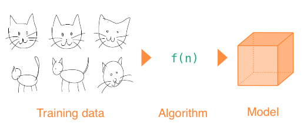

# Machine Learning

- Introduction
- Workshop
- Reading list

### What is Machine Learning?

Put simply, a Machine Learning project can learn from itself or from data that you provide. Instead of programming logic yourself, you will train a *model* and then let that model make decisions.

These models can often find patterns in complex data that even the smartest programmer could not have discovered. At the same time, training a model can have its own biases and preconceptions that you have to be aware of.


- Artificial Intelligence: you program a character to drink a potion once his health gets too low.
- Machine Learning: you train a model with previous combat data, and then let it decide what is the best moment to drink a health potion.

### Algorithms

A model is built using an *algorithm*. When starting a Machine Learning project, you have to look carefully at the data you have available, and the kind of result you need, so you can determine which algorithm fits that need.



*Using an algorithm to train a model to recognise cat drawings. This step is needed only once.*


*Once you have the model, you can ask to what degree a new drawing resembles a cat. Or you could even let it imagine new cat drawings!*

#### Real world application

Replace the cat images with credit card transactions, including data that mentions if the transaction was fraudulent. After training a model with this data, you can test new transactions for being fraudulent.

**model

Train a model with **date, amount, user, location, shop** as numbers in an array. The data is labeled as **valid** or **invalid**.
```
network.train(
  [12122018, 33, 2282, 3, 55], valid
  [10212017, 24, 4343, 6, 45], valid
  [12122018, 112, 1231, 6, 12], invalid
)
```
**test a new transaction**
```
var valid = network.test([10212017, 24, 4343, 6, 45])
```

### Neural Networks

A Neural Network is inspired by the human brain. Data will flow through *neurons* in the network. Each neuron has *weights* that decide to which next neuron the data should flow. By training the network, the weights are calculated to show the desired result. 

- [But what *is* a neural network? - youtube](http://www.youtube.com/playlist?list=PLZHQObOWTQDNU6R1_67000Dx_ZCJB-3pi)
- [Neural networks demystified](http://lumiverse.io/series/neural-networks-demystified)

#### Using existing tools

Instead of writing algorithms yourself, you will often choose an existing library, based on your data and your expected output. Tools exist for:

- Image Recognition
- Speech Recognition
- Language Generation
- Body Pose Recognition
- And many more

# Workshop

The workshop will use Javascript to learn the following concepts:

- Part 1 - Using a pre-trained Model
- Part 2 - Training our own model
- Part 3 - Understanding an algorithm

## Workshop Part 1 - Using a pre-trained model

In this tutorial we will load an image recognition library, and a pre-trained model to classify an image:

- [Classify an image with Tensorflow in 5 lines of code](https://codepen.io/eerk/pen/JmKQLw)


## Workshop Part 2 - Training our own model

#### Predicting a soccer match

In this example we will train a neural network with the results of previous football matches. Based on these results the network will predict the result of a future match. Let's say the result of the previous football matches has been:

- Team 1 versus team 2: Team 2 won
- Team 1 versus team 3: Team 3 won
- Team 2 versus team 3: Team 2 won
- Team 2 versus team 4: Team 4 won

We will first load the Neural Network library BrainJS:

`<script src="brain.js"></script>`

Then, we can instantiate the type of Neural Network that fits the problem we are trying to solve:

`const network = new brain.NeuralNetwork()`

Now, we can train our model with the results of previous matches:
```
network.train([
    { input: [1,2], output: [1] },  // team 2 wins
    { input: [1,3], output: [1] },  // team 3 wins
    { input: [2,3], output: [0] },  // team 2 wins
    { input: [2,4], output: [1] }   // team 4 wins
])
```
Finally, we can run a new match and get the expected result!
```
const prediction = network.run([1,1])
console.log(`probability is: ${prediction}`)    
```

#### Understanding spoken commands

The **LSTM** neural net works well for interpreting sequential data, such as sentences, drawings, or musical melodies. 

`const network = new brain.recurrent.LSTM()`

In this example we will use an LSTM to interpret commands for a smart home. We will start by supplying as many variations for our home automation as possible. This is just an example, to make it work well you need lots more training data!

```
var trainingdata = [
    { input: 'Switch on the lights please', output: 'light' },
    { input: 'Turn the lights on', output: 'light' },
    { input: 'Can someone switch the lights on?', output: 'light' },
    { input: 'I'd like some music', output: 'music' },
    { input: 'Let's hear some music', output: 'music' }
]
```
When training a neural network, you can supply a number of iterations to make the predictions more accurate:

```
network.train(trainingdata, {
    iterations:2000
})
```
Now, when we have new user input, we can interpret the meaning:

```
const meaning = network.run('I'd like a little more light')
console.log(`Home system command: ${output}`)
```

#### Saving the model

You don't want to train a model every time a user starts an app. In BrainJS, you can view the model data as JSON, so you can save it to a file:

```
var trainingData = network.toJSON()
console.log(trainingData)
```
If you have data from a JSON file, you can train the network with this data:
```
network.fromJSON(trainingData);
```

## Workshop Part 3 - Understanding an algorithm

This algorithm uses the distance between points to classify a new point. The KNN algorithm is useful to understand the basics of training a model and classifying data, without a complex algorithm:

- [Using the 'k-nearest neighbour' algorithm to train a model](https://github.com/NathanEpstein/KNear)
- [Tutorial for 'K-Nearest-Neighbour'](https://github.com/KokoDoko/webcam-detectotron)

# Javascript

Javascript allows us to publish our projects online, and provides easy ways to visualise our results using html and css.

## Brain JS

[BrainJS](https://github.com/BrainJS/brain.js) is a library that allows you to instantiate a Neural Network, train it and run a classification in just a few lines of code.

- [How to create a Neural Net in the browser with BrainJS](https://scrimba.com/c/c36zkcb)
- [Source code and examples for BrainJS](https://github.com/BrainJS/brain.js)
- [BrainJS tutorial for beginners on Youtube](https://www.youtube.com/watch?v=RVMHhtTqUxc)

## Tensorflow JS

The Javascript version of Google TensorFlow. TensorflowJS has lots of tutorials, and add-on libraries that make working with it even easier.

- [Tensorflow for Javascript](https://js.tensorflow.org)
- [Hello World in Tensorflow.JS](https://dev.to/notwaldorf/hello-tensorflow-2lc5)
- [Basic tutorial for setting up Tensorflow Neural Network](https://codelabs.developers.google.com/codelabs/neural-tensorflow-js/index.html)
- [Tutorial course for Audio recognition](https://codelabs.developers.google.com/codelabs/tensorflowjs-audio-codelab/)
- [Tutorial course for Webcam recognition](https://codelabs.developers.google.com/codelabs/tensorflowjs-teachablemachine-codelab/index.html)

### ML5

ML5 makes TensorFlowJS more accessible by supplying readymade examples with clear documentation for the most common Machine Learning projects, such as image classification, pose recogition, and text generation.

- [Simplify working with TensorflowJS using the ML5 library](https://ml5js.org)


*Pose Estimation using the Webcam with ML5 and TensorflowJS*

### Magenta JS

- [Magenta](https://magenta.tensorflow.org/get-started/#magenta-js) is a google library that uses tensorflow to generate [images](https://tensorflow.github.io/magenta-js/image/index.html), [music](https://tensorflow.github.io/magenta-js/music/index.html) and [sketches](https://tensorflow.github.io/magenta-js/sketch/). 
- [Tutorial on drawing snowflakes with a Neural Network and Magenta](https://youtu.be/pdaNttb7Mr8)

## Perceptron

A perceptron is a Neural Network that has only one cell. You can code it by hand in just a few lines of code. This will help you to understand how one Neural Network cell calculates weights.

- [Coding a perceptron in Javascript, by Mathias P Johansson](https://youtu.be/o98qlvrcqiU), and the [result](https://beta.observablehq.com/@mpj/neural-network-from-scratch-part-1)

## Synaptic JS

Synaptic is another Neural Network Library for Javascript

- [Synaptic JS Neural Networks](http://caza.la/synaptic/)
- [Tutorial for Synaptic JS](https://medium.freecodecamp.org/how-to-create-a-neural-network-in-javascript-in-only-30-lines-of-code-343dafc50d49)

# Python

[Python](https://www.python.org) is used by data scientists and in many Machine Learning courses online. Python requires a bit more setup, especially when you want to visualise results graphically. Python can run on a Raspberry Pi!

- [Udacity Intro to Machine Learning with Python](https://www.udacity.com/course/intro-to-machine-learning--ud120)
- [Building a perceptron from scratch](https://medium.com/@ismailghallou/build-your-perceptron-neural-net-from-scratch-e12b7be9d1ef) and [source code](https://github.com/smakosh/Perceptron-neural-net-from-scratch)
- [Building camera detection on a raspberry pi](https://www.youtube.com/watch?v=2kO8ScrqikM)

### Science Kit Learn

Science Kit Learn provides Python libraries, readymade datasets and algorithms for testing, and a visualisation tool. Get started running python with this tutorial:

- [SKLearn](http://scikit-learn.org/stable/)
- [Introduction to machine learning with scikit-learn](http://scikit-learn.org/stable/tutorial/basic/tutorial.html#machine-learning-the-problem-setting)

### Tensorflow

Tensorflow is Google's Machine Learning API for Python

- [Google Tensorflow tutorials](https://www.tensorflow.org/tutorials/)
- [Getting Started with TensorFlow](https://www.tensorflow.org/get_started/get_started)
- [Introduction to Deep Learning and Tensorflow](https://pythonprogramming.net/tensorflow-introduction-machine-learning-tutorial/)

### Keras

Keras is a high-level neural networks API, written in Python and capable of running on top of TensorFlow

- [Why use Keras?](https://keras.io/why-use-keras/)
- [Keras](https://keras.io)

# Wekinator

Wekinator is a Graphical User Interface that can apply Machine Learning algorithms to Processing and Arduino sensor data. 

- [Wekinator](http://www.wekinator.org)
- [Wekinator workshop by Kars Alfrink](https://github.com/karsalfrink/useless-butler)

# Machine Learning Disciplines

- Image Recognition
- Natural Language Processing
- Speech Recognition
- Pose Estimation

### Image recognition


- [YOLO - you only look once](https://pjreddie.com/darknet/yolo/) Image recognition network, watch the cool [intro movie!](https://www.youtube.com/watch?v=MPU2HistivI)
- [Vize.ai Recognize and automate your images](https://vize.ai)
- [Clarifai image and video recognition tool](https://clarifai.com/developer/)
- [TensorFlow image recognition](https://www.tensorflow.org/tutorials/image_recognition)
- [ImageNet - readymade training data for image recognition](http://www.image-net.org)
- [GoCV - Use the GO programming language for Computer Vision](https://gocv.io)

### Natural Language Processing

Understanding the meaning of written text

- [What are word vectors?](https://gist.github.com/aparrish/2f562e3737544cf29aaf1af30362f469)
- [Understanding Word2Vec Video by Daniel Shiffman](https://youtu.be/MOo9iJ8RYWM)
- [Natural Language Processing with Spacy.io](https://spacy.io)

### Speech Recognition

Converting spoken audio into text

- [Mozilla Deep Speech - blog post](https://blog.mozilla.org/blog/2017/11/29/announcing-the-initial-release-of-mozillas-open-source-speech-recognition-model-and-voice-dataset/) and [code](https://github.com/mozilla/DeepSpeech)
- [Google TacoTron Self-learning Speech Synthesizer](https://github.com/keithito/tacotron)
- [Pocket Sphynx Speech Recognition](https://github.com/cmusphinx/pocketsphinx)

### Pose Estimation

- [Pose Estimation with TensorflowJS](https://medium.com/tensorflow/real-time-human-pose-estimation-in-the-browser-with-tensorflow-js-7dd0bc881cd5)

### Paid services

- [Microsoft Machine Learning APIs](https://gallery.azure.ai/machineLearningAPIs)
- [Apple Core ML framework](https://developer.apple.com/documentation/coreml)
- [Machine Learning on Amazon Web Services](https://aws.amazon.com/machine-learning/)
- [Amazon Machine Learning Free Course](https://aws.amazon.com/training/learning-paths/machine-learning/)

# Reading list


- [The Mostly Complete Chart of Neural Networks](https://towardsdatascience.com/the-mostly-complete-chart-of-neural-networks-explained-3fb6f2367464)
- [More algorithms for Machine Learning](https://towardsdatascience.com/a-tour-of-the-top-10-algorithms-for-machine-learning-newbies-dde4edffae11)
- [Neural Networks Wiki page](https://en.wikipedia.org/wiki/Artificial_neural_network)
- [Machine Learning for Humans](https://medium.com/machine-learning-for-humans/why-machine-learning-matters-6164faf1df12)
- [Machine Learning for designers](http://www.oreilly.com/design/free/machine-learning-for-designers.csp)
- [A visual introduction to Machine Learning](http://www.r2d3.us/visual-intro-to-machine-learning-part-1/)
- [Deep learning book](http://www.deeplearningbook.org)
- [Build more intelligent apps with machine learning](https://developer.apple.com/machine-learning/)(Apple)
- [Researching the use of ML in creative applications](http://blog.otoro.net)
- [Design in the era of the algorithm](https://bigmedium.com/speaking/design-in-the-era-of-the-algorithm.html)
- [Human-Centered Machine Learning](https://medium.com/google-design/human-centered-machine-learning-a770d10562cd)
- [The UX of AI (Google Design)](https://design.google/library/ux-ai/)
- [Linear algebra - the math behind ML algorithms](http://www.mathscoop.com/calculus/derivatives/derivative-by-definition.php)
- [Maths for Programmers](https://www.freecodecamp.org/news/beaucarnes/maths-for-programmers--09iy8H6lC)
- [Paul G Allen Course on Machine Learning algorithms](https://www.youtube.com/user/UWCSE/playlists?shelf_id=16&sort=dd&view=50)
- [Mastering Machine Learning with MatLab for Python](https://nl.mathworks.com/campaigns/offers/mastering-machine-learning-with-matlab.html?s_eid=PSB_17921)
- [Deep Learning Simplified - Youtube series](https://www.youtube.com/playlist?list=PLjJh1vlSEYgvGod9wWiydumYl8hOXixNu)
- [Neural Networks and Deep Learning - book recommended by Tensorflow](http://neuralnetworksanddeeplearning.com)
- [Deep Learning Gone Wrong - How ML expectations don't always match with results](https://docs.google.com/spreadsheets/u/1/d/e/2PACX-1vRPiprOaC3HsCf5Tuum8bRfzYUiKLRqJmbOoC-32JorNdfyTiRRsR7Ea5eWtvsWzuxo8bjOxCG84dAg/pubhtml)

# Community

- [AI Stackoverflow](https://ai.stackexchange.com)
- [Kaggle - Machine Learning challenges](https://www.kaggle.com)

# Demos and projects

- [Amazon Deep Racer - order the self-driving amazon toy car, and compete with driving algorithms](https://aws.amazon.com/deepracer/)
- [Teleport Vision - generates HTML from pen and paper sketches](https://github.com/teleporthq/teleport-vision-api)
- [Build a perceptron in Processing](https://www.youtube.com/watch?v=ntKn5TPHHAk)
- [Training a model in Unity using a neural network](https://github.com/ArztSamuel/Applying_EANNs)
- [Neural Drum Machine](https://codepen.io/teropa/pen/JLjXGK) and [Voice-based beatbox](https://codepen.io/naotokui/pen/NBzJMW) created with [MagentaJS](https://magenta.tensorflow.org)
- [Demo for creating a self-learning Flappy Bird in Javascript](https://github.com/ssusnic/Machine-Learning-Flappy-Bird)
- [Algorithm notes](http://books.goalkicker.com/AlgorithmsBook/)
- [Google AI experiments](https://experiments.withgoogle.com/ai)
- [Building a cat detector on a Raspberry Pi](https://planb.nicecupoftea.org/2018/12/01/cat-detector-with-tensorflow-on-a-raspberry-pi-3b/)
- [Quick Draw! - Can a Neural Network detect a doodle?](https://quickdraw.withgoogle.com)
- [Pyro - Uber's AI programming language](http://pyro.ai)
- [Runway - An app that adds ML to creative projects](https://runwayapp.ai)
- [Pixling - Building a life simulation app with Neural Networks](http://wiki.pixling.world/index.php/Main_Page)
- [Building a self-driving Mario Kart using TensorFlow](https://www.youtube.com/watch?v=Ipi40cb_RsI) and [documentation](https://www.youtube.com/redirect?q=https%3A%2F%2Fdocs.google.com%2Fdocument%2Fd%2F1p4ZOtziLmhf0jPbZTTaFxSKdYqE91dYcTNqTVdd6es4%2Fedit%3Fusp%3Dsharing&event=video_description&v=Ipi40cb_RsI&redir_token=Ybzxsbpmjb-vKOmpvcRlyEses5V8MTUxMzMzODkwNUAxNTEzMjUyNTA1)

## The future


[https://xkcd.com/1925/](https://xkcd.com/1925/)
