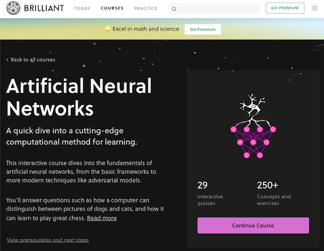
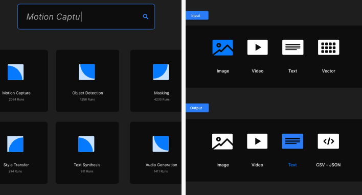
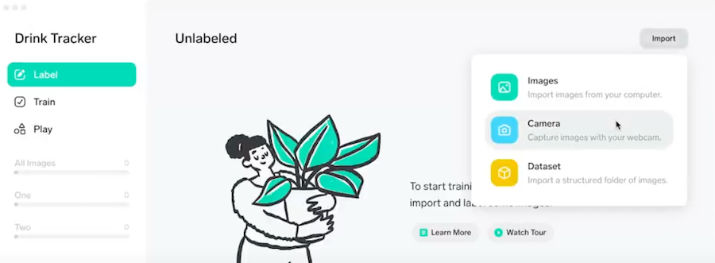
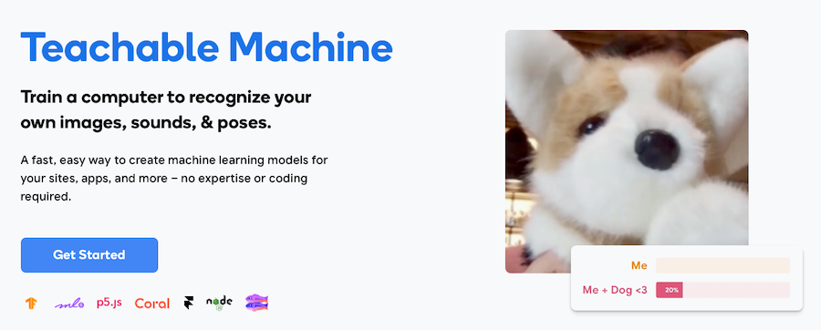
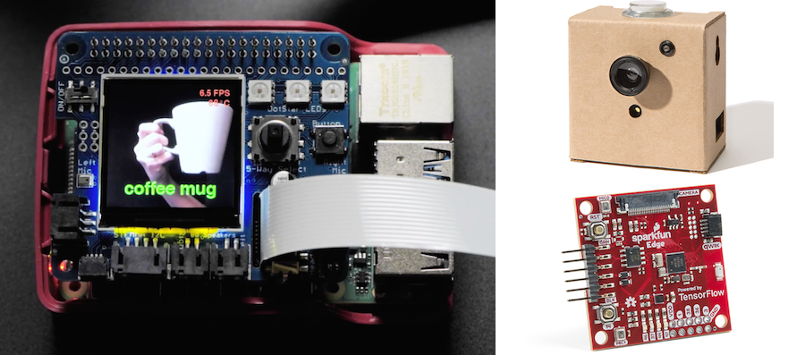
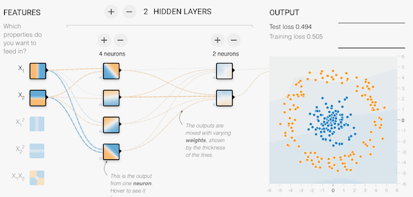

# Machine Learning Reading List

This repository maintains a reading list of Machine Learning technologies, algorithms and API's. You'll find tons of tools, ideas and tutorials to get started experimenting with Machine Learning in Javascript.

[CMGT students can find the accompanying PRG08 course materials here](https://github.com/HR-CMGT/PRG08-2020-2021)

 
 
 

# Contents

- [Quick Introduction](./introduction.md)
  - Training, algorithms, and models
  - Solving ML problems with Javascript
  - Javascript code examples
- [Reading list](#readinglist)
  - What is Machine Learning?
  - Designing for AI
  - Algorithms in Javascript
  - Images
  - Text and speech
  - Games
  - API'S
  - Creative Coding
- [No Code Machine Learning](#nocode)
  - Analyse data without programming
- [Hardware](#hardware)
  - ML with Raspberry Pi, Arduino and Adafruit hardware
- [Datasets](#datasets)
- [Community](#community)
- [Demos and tutorials](#examples)
  - Tons of crazy code examples, including a self-driving Mario Kart.

 

### Disclaimer

Some of the code examples and links may be outdated or expired, please make an issue or a pull request if you have any updates or suggestions!

 
 
 

# Quick Introduction

Check out the [quick introduction](./introduction.md) to check what ML problems you can solve with javascript, including code examples!

 
 

# What is Machine Learning?

Books and videos that help you learn the main concepts. Find a book or video that works for you and get started!

- [🔥 Brilliant.org - tutorial app with daily questions](https://brilliant.org/courses/artificial-neural-networks/)
- [🔥 Elements of AI - introduction to basic concepts](https://course.elementsofai.com) and [part 2: building AI](https://buildingai.elementsofai.com)
- [📺  Documentary - the Age of AI](https://www.youtube.com/playlist?list=PLjq6DwYksrzz_fsWIpPcf6V7p2RNAneKc)
- [📺  Crash Course - what is AI?](https://www.youtube.com/watch?v=a0_lo_GDcFw)
- [Machine Learning for Everyone](https://vas3k.com/blog/machine_learning/)
- [A tour of machine learning algorithms](https://machinelearningmastery.com/a-tour-of-machine-learning-algorithms/)
- [The Mostly Complete Chart of Neural Networks](https://towardsdatascience.com/the-mostly-complete-chart-of-neural-networks-explained-3fb6f2367464)
- [An intuitive explanation of convolutional neural networks](https://ujjwalkarn.me/2016/08/11/intuitive-explanation-convnets/)
- [Introduction to Deep Learning](https://media.ccc.de/v/35c3-9386-introduction_to_deep_learning)
- [Algorithms for Machine Learning](https://towardsdatascience.com/a-tour-of-the-top-10-algorithms-for-machine-learning-newbies-dde4edffae11)
- [Neural Networks Wiki page](https://en.wikipedia.org/wiki/Artificial_neural_network)
- [Machine Learning for Humans](https://medium.com/machine-learning-for-humans/why-machine-learning-matters-6164faf1df12)
- [A visual introduction to Machine Learning](http://www.r2d3.us/visual-intro-to-machine-learning-part-1/)
- [Deep learning book](http://www.deeplearningbook.org)
- [📺  Deep Learning Simplified - Youtube series](https://www.youtube.com/playlist?list=PLjJh1vlSEYgvGod9wWiydumYl8hOXixNu)
- [Machine Learning for Kids](https://machinelearningforkids.co.uk/)
- [Deep Learning Gone Wrong - How ML expectations don't always match with results](https://docs.google.com/spreadsheets/u/1/d/e/2PACX-1vRPiprOaC3HsCf5Tuum8bRfzYUiKLRqJmbOoC-32JorNdfyTiRRsR7Ea5eWtvsWzuxo8bjOxCG84dAg/pubhtml)
- [Neural Networks and Deep Learning](http://neuralnetworksanddeeplearning.com)
- [HR Datalab: Rob vd Willigen's Blog about AI](https://robfvdw.medium.com)

## Designing for AI

- [AI meets design - idea generator](http://aimeets.design/prompt/) and [AI design toolkit](http://aimeets.design/toolkit/)
- [ML+ Design - a reading list about designing for ML applications](https://machinelearning.design)
- [Design in the era of the algorithm](https://bigmedium.com/speaking/design-in-the-era-of-the-algorithm.html)
- [📺  AI is your new design material](https://www.youtube.com/watch?v=Tgzu351uDIc)
- [Human-Centered Machine Learning](https://medium.com/google-design/human-centered-machine-learning-a770d10562cd)
- [The UX of AI](https://design.google/library/ux-ai/)
- [The human side of AI](https://pair.withgoogle.com)
- [Machine Learning for designers](http://www.oreilly.com/design/free/machine-learning-for-designers.csp)

## Algorithms in Javascript

- [📺  The Coding Train](https://thecodingtrain.com)
- [📺  Math concepts for Programmers](https://www.youtube.com/watch?v=2SpuBqvNjHI)
- [🔥 Super clear Neural Networks Tutorial in TensorflowJS](https://codelabs.developers.google.com/codelabs/tfjs-training-regression/index.html)
- [Building a TensorflowJS UI with Parcel Bundler](https://medium.com/codingthesmartway-com-blog/tensorflow-js-crash-course-machine-learning-for-the-web-getting-started-50694a575238)
- [K-Nearest Neighbour](https://github.com/NathanEpstein/KNear) and an [explanation of writing your own KNN in Javascript](https://burakkanber.com/blog/machine-learning-in-js-k-nearest-neighbor-part-1/)
- [K-Means](https://miguelmota.com/blog/k-means-clustering-in-javascript/)
- [Decision Tree](https://github.com/lagodiuk/decision-tree-js)
- [📺  Perceptron in pure JS](https://www.youtube.com/watch?v=o98qlvrcqiU) or use this [code snippet](https://gist.github.com/primaryobjects/dfb8927f9f0ca21b6a24647168cead41)
- [Movie Recommender System in Javascript](https://github.com/javascript-machine-learning/movielens-recommender-system-javascript) and a [quick and dirty tutorial on building your own recommender system](https://dev.to/jimatjibba/build-a-content-based-recommendation-engine-in-js-2lpi)
- [Visualise data with TFVis](https://js.tensorflow.org/api_vis/1.4.3/), [VEGA](https://vega.github.io/vega/) or [PlotlyJS](https://plotly.com/javascript/)
- [Manipulate large amounts of data with Danfo.js](https://danfo.jsdata.org)

## Images 

- [Object Detection in ML5](https://learn.ml5js.org/#/reference/object-detector) - what is [YOLO?](https://www.youtube.com/watch?v=MPU2HistivI)
- [Improving a pre-trained model in ML5](https://ml5js.org/reference/api-FeatureExtractor/), with a [workshop](./extractfeatures/readme.md) and [youtube tutorial](https://www.youtube.com/watch?v=eeO-rWYFuG0)
- [Use a Convolutional Neural Network in ML5 to train with images from scratch](https://learn.ml5js.org/#/reference/neural-network?id=a-convolutional-neural-network-for-image-classification-tasks)
- [Face-JS, a library to track facial expressions](https://justadudewhohacks.github.io/face-api.js/docs/index.html)
- [TrackingJS, an image recognition library for Javascript](https://trackingjs.com)
- [Hand Tracking JS](https://victordibia.github.io/handtrack.js/) en [HandPose API](https://github.com/tensorflow/tfjs-models/tree/master/handpose)

## Language and speech

- [What is Natural Language Processing?](https://towardsdatascience.com/natural-language-processing-from-basics-to-using-rnn-and-lstm-ef6779e4ae66) and [Natural Language Processing in Javascript](http://naturalnode.github.io/natural/)
- [Listen to human speech in the browser](https://developer.mozilla.org/en-US/docs/Web/API/Web_Speech_API/Using_the_Web_Speech_API), and a [Simple demo of listening and speaking with javascript](https://github.com/mdn/web-speech-api)
- [Understand sentiment in ML5](https://ml5js.org/reference/api-Sentiment/) and [javascript](https://github.com/thisandagain/sentiment)
- [What are word vectors?](https://gist.github.com/aparrish/2f562e3737544cf29aaf1af30362f469) and [📺  Understanding Word2Vec](https://youtu.be/MOo9iJ8RYWM)
- [Using the new GPT-3 advanced language tool in Javascript](https://www.twilio.com/blog/getting-started-with-openai-s-gpt-3-in-node-js)

## Games

- [Getting started with ML in Unity](./unity.md)
- [Unity Learn: ML Agents Course](https://learn.unity.com/course/ml-agents-hummingbirds)
- [Computer Vision in Unity with Vuforia](https://library.vuforia.com/articles/Training/getting-started-with-vuforia-in-unity.html)
- [TensorFlow plugin for Godot](https://github.com/godot-extended-libraries/godot-tensorflow-workspace)
- [OpenAI GYM - a game environment to train AI with Python](http://gym.openai.com)

## API's

- Google API's for [Translate](http://cloud.google.com/translate/), [Vision](http://cloud.google.com/vision/), [Speech](http://cloud.google.com/speech/) and [Language Processing](http://cloud.google.com/natural-language/)
- [Build AI Bots with DialogFlow](https://cloud.google.com/dialogflow)
- [Google ML Kit for iOS and Android](https://developers.google.com/ml-kit)
- [Microsoft Azure Machine Learning APIs](https://gallery.azure.ai/machineLearningAPIs)
- [Apple Core ML framework](https://developer.apple.com/documentation/coreml) and [tutorials](https://developer.apple.com/machine-learning/)
- [Amazon Deep Racer](https://aws.amazon.com/deepracer/), [Machine Learning API's](https://aws.amazon.com/machine-learning/) and [Free Course](https://aws.amazon.com/training/learning-paths/machine-learning/)

## Creative Coding

- [Magenta](https://magenta.tensorflow.org/get-started/#magenta-js) is a google library that uses tensorflow to generate [images](https://tensorflow.github.io/magenta-js/image/index.html), [music](https://tensorflow.github.io/magenta-js/music/index.html) and [sketches](https://tensorflow.github.io/magenta-js/sketch/). 
- [A list of Creative AI Tools](https://creative-ai.org)
- [Six different tools for music generation with ML](https://www.asimovinstitute.org/analyzing-deep-learning-tools-music/)
- [Researching the use of ML in creative applications](http://blog.otoro.net)
- [Wekinator](http://www.wekinator.org) is a GUI that can apply Machine Learning algorithms to Processing and Arduino sensor data - [check the tutorial.](http://www.wekinator.org/kadenze/)
- [ArtBreeder - generate children from image parents!](https://www.artbreeder.com)

 
 
 
 

# No Code Machine Learning

Tools for training a model without programming

- [Runway ML](https://runwayml.com) - use ML in your creative projects with an intuitive visual interface. See the demo: [greenscreen any video](https://youtu.be/aeywFO2dOwA)

- [Lobe.AI](https://lobe.ai) is microsoft's tool for training and exporting a machine learning model without coding. Can export to TensorFlow.js for the web. 

- Google's [Teachable Machine](https://teachablemachine.withgoogle.com) can export a machine learning model for use with Javascript in TensorFlowJS or ML5.js.

- [Obviously.ai](https://www.obviously.ai) can train a model with CSV data right in the browser.

 
 

# Hardware

- [Braincraft AI kit for Raspberry Pi](https://learn.adafruit.com/adafruit-braincraft-hat-easy-machine-learning-for-raspberry-pi)
- [🔥 Mycroft is a private smart home assistant](https://mycroft.ai) - no need to send your voice data to google, apple or amazon!
- [Google's Do-it-yourself Raspberry Pi AI Kits](https://aiyprojects.withgoogle.com/vision/)
- [Edge microcontroller can run TensorFlow Lite](https://www.sparkfun.com/products/15170) from SparkFun
- [Corel.AI Tensorflow Hardware](https://coral.ai/products/) en [📺 Marshmallow detector demo](https://coral.ai/projects/teachable-sorter/)
- [Build a teachable robot with Raspberry Pi and Arduino](https://experiments.withgoogle.com/alto)
- [Read more in the Python reading list](./python.md)

 
 

# Datasets

- [Kaggle Datasets](https://www.kaggle.com/datasets/)
- [MovieLens - data on 45.000 movies by 270.000 users](https://www.kaggle.com/rounakbanik/the-movies-dataset/data)
- [Google Dataset Search](https://datasetsearch.research.google.com) 
- [🐱 Cats per square kilometer](https://data.gov.uk/dataset/9d475e06-3885-4a90-b8c0-77fea13f92e6/cats-per-square-kilometre)
- [Speech Audio dataset](https://keithito.com/LJ-Speech-Dataset/)
- [QuickDraw - Doodles dataset](https://github.com/googlecreativelab/quickdraw-dataset/)
- [COCO - Common Objects in Context](https://cocodataset.org/#home)
- [Socrata Open Data search](https://dev.socrata.com/data/)
- [Rotterdam Open Data](http://rotterdamopendata.nl/dataset)

## Pre-trained models

- [Use pre-trained models for image, audio and object recognition in Javascript](https://github.com/tensorflow/tfjs-models)
- [ImageNet - pretrained models](http://www.image-net.org)
- [MobileNet - pretrained models](https://github.com/tensorflow/models/blob/master/research/slim/nets/mobilenet_v1.md)

 
 

# Community

- [AI Stackoverflow](https://ai.stackexchange.com)
- [Kaggle - Machine Learning challenges](https://www.kaggle.com)
- [Welcome.ai Instagram](https://www.instagram.com/welcome.ai/)
- [AI x Design Community](https://www.aixdesign.co) and [Instagram](https://www.instagram.com/aixdesign.community/)
- [Rotterdam AI Meetup](https://www.meetup.com/Explore-Artificial-Intelligence-Rotterdam/)

 
 

# Demos and tutorials

- [Tensorflow Playground](https://playground.tensorflow.org) 😱
- [Visualise how a Neural Network recognises numbers](https://www.cs.cmu.edu/~aharley/vis/conv/flat.html)
- [📺 Build a security camera with TensorflowJS and React](https://www.youtube.com/watch?v=7QBYX65t7Mw)
- [Tone Transfer example](https://twitter.com/HanoiHantrakul/status/1258803013948342272?s=20)
- [NVidia AI playground](https://www.nvidia.com/en-us/research/ai-playground/)
- [📺 Coding a perceptron in Javascript, by Mathias P Johansson](https://youtu.be/o98qlvrcqiU), and the [result](https://beta.observablehq.com/@mpj/neural-network-from-scratch-part-1)
- [Creating a Recommender System in Javascript](https://github.com/javascript-machine-learning/movielens-recommender-system-javascript) and in [Python](https://towardsdatascience.com/how-to-build-a-simple-recommender-system-in-python-375093c3fb7d)
- [Sketch2Code Live - Generate HTML from hand-drawn UI sketches](https://sketch2code.azurewebsites.net)
- [Teleport Vision Github - Generate HTML from hand-drawn UI sketches](https://github.com/teleporthq/teleport-vision-api)
- [Using a Javascript Perceptron to classify dangerous snakes](https://github.com/elyx0/rosenblattperceptronjs)
- [Classify an image on Codepen in 5 lines of Javascript](https://codepen.io/eerk/pen/JmKQLw)
- [Train a Train - small game where a vehicle learns to drive](https://github.com/lkoppenol/train-a-train)
- [Neural Drum Machine](https://codepen.io/teropa/pen/JLjXGK) and [Voice-based beatbox](https://codepen.io/naotokui/pen/NBzJMW) created with [MagentaJS](https://magenta.tensorflow.org)
- [Demo for creating a self-learning Flappy Bird in Javascript](https://github.com/ssusnic/Machine-Learning-Flappy-Bird)
- [Algorithm notes](http://books.goalkicker.com/AlgorithmsBook/)
- [Google AI experiments](https://experiments.withgoogle.com/ai)
- [Building a cat detector on a Raspberry Pi](https://planb.nicecupoftea.org/2018/12/01/cat-detector-with-tensorflow-on-a-raspberry-pi-3b/)
- [Quick Draw! - Can a Neural Network detect a doodle?](https://quickdraw.withgoogle.com) and the [open source drawing dataset](https://github.com/googlecreativelab/quickdraw-dataset/)
- [Imagine drawing a cat!](http://projects.eerkmans.nl/cat/)
- [Building a self-driving Mario Kart using TensorFlow](https://www.youtube.com/watch?v=Ipi40cb_RsI) and [documentation](https://www.youtube.com/redirect?q=https%3A%2F%2Fdocs.google.com%2Fdocument%2Fd%2F1p4ZOtziLmhf0jPbZTTaFxSKdYqE91dYcTNqTVdd6es4%2Fedit%3Fusp%3Dsharing&event=video_description&v=Ipi40cb_RsI&redir_token=Ybzxsbpmjb-vKOmpvcRlyEses5V8MTUxMzMzODkwNUAxNTEzMjUyNTA1)
- [Learning Neural Networks with Processing](https://natureofcode.com/book/chapter-10-neural-networks/)
- [While True : Learn() - a game that teaches you all about Machine Learning](https://luden.io/wtl/)
- [Synaptic JS Neural Networks](http://caza.la/synaptic/) and [Tutorial](https://medium.freecodecamp.org/how-to-create-a-neural-network-in-javascript-in-only-30-lines-of-code-343dafc50d49)
- [Dr. Derk's mutant battlegrounds](https://store.steampowered.com/app/1102370/Dr_Derks_Mutant_Battlegrounds/)
- [AI Dungeon](https://play.aidungeon.io)
- [List of Javascript Maschine Learning algorithms and presentations](https://bri.im/)
- [Control a ThreeJS game with Teachable Machine](https://github.com/charliegerard/whoosh)
- [Silence of the Fans - running TensorflowJS on Google Colab](https://dev.to/obenjiro/silence-of-the-fans-part-1-javascript-quickstart-5f3m) - and [code example](bit.ly/colabjs)

---

 
 

[https://xkcd.com/1925/](https://xkcd.com/1925/)
