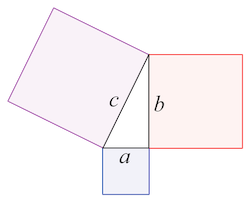
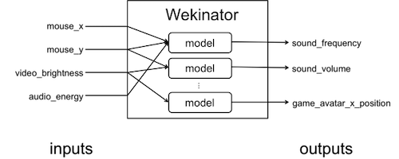

# HR CMGT Machine Learning

## Introduction

- [Introduction](#introduction)
- [Workshop](./workshop/introduction.md)

## Programming

- [Javascript](#javascript)
- [Python](#python)
- [Wekinator](#wekinator)
- [ML Disciplines](#disciplines)
- [Tools and services](#services)

## Reading

- [Reading list](#readinglist)
- [Community](#community)
- [Demos and example projects](#examples)

 
 
 

---

# Introduction

Traditionally, developers write *sets of instructions*, also known as a *computer program*, to solve complex problems. This traditional approach has its limitations, especially when we want the computer to solve human tasks, such as recognising a drawing, or talking on the phone.

By using a Machine Learning algorithm, the computer can learn to recognise patterns in complex data all by itself. A machine learning algorithm can reveal patterns that would otherwise not have been found. The computer can learn to make decisions and to improve itself.

*Using an algorithm to train a model to recognise cat drawings*

*A model can compare new drawings to cats, and it can even imagine new cat drawings*

## Algorithms

Algorithms are used to find patterns in complex data. Surprisingly, the algorithm itself does not have to be all that complex. You can start a machine learning project just by using the good old Pythagorean theorem:

#### Our first Machine Learning algorithm: *a2+b2=c2*

By looking at your data and defining the goal of your project, you will have to decide on an algorithm that suits your purposes the best. 

Simpler algorithms work faster, and allow for more introspection. As a developer you will have a lot of control on its output. 

Neural networks can analyse very complex data, and can learn from itself. A neural net may take a lot of time to train, and will create a sort of "black box", making it less transparent to understand how it makes decisions.

## Workshop

In the [Workshop](./workshop/introduction.md) you will learn the basics of using existing libraries and preparing data to train a neural network.  

Below you will find links to popular libraries with tutorials, existing kits, books and demo projects.

 
 
 

---

# Javascript

Javascript allows us to publish our projects online, and provides easy ways to visualise our results using html and css.

### Brain JS

[BrainJS](https://github.com/BrainJS/brain.js) is a library that allows you to instantiate a Neural Network, train it and run a classification in just a few lines of code.

- [Source code and examples for BrainJS](https://github.com/BrainJS/brain.js)
- [Traversy BrainJS introduction](https://www.youtube.com/watch?v=RVMHhtTqUxc)
- [Recognise letters](https://github.com/BrainJS/brain.js/blob/master/examples/which-letter-simple.js)
- [Recognise a drawing](https://output.jsbin.com/mofaduk) and [code](https://gist.github.com/mac2000/fc54e6d6bdcbfde28b03dc2a43611270)
- [Advanced Image feature detection using BrainJS](https://scrimba.com/c/c36zkcb)

### Tensorflow JS

The Javascript version of Google TensorFlow. TensorflowJS has lots of tutorials, and add-on libraries that make working with it even easier.

- [Tensorflow for Javascript](https://js.tensorflow.org)
- [Hello World in Tensorflow.JS](https://dev.to/notwaldorf/hello-tensorflow-2lc5)
- [Basic tutorial for setting up Tensorflow Neural Network](https://codelabs.developers.google.com/codelabs/neural-tensorflow-js/index.html)
- [Tutorial course for Audio recognition](https://codelabs.developers.google.com/codelabs/tensorflowjs-audio-codelab/)
- [Tutorial course for Webcam recognition](https://codelabs.developers.google.com/codelabs/tensorflowjs-teachablemachine-codelab/index.html)
- [Tensorflow Playground](https://playground.tensorflow.org) 😱

### ML5

ML5 makes TensorFlowJS more accessible by supplying readymade examples with clear documentation for the most common Machine Learning projects, such as image classification, pose recogition, and text generation.

- [Simplify working with TensorflowJS using the ML5 library](https://ml5js.org)

*Pose Estimation using the Webcam with ML5 and TensorflowJS*

### Magenta JS

- [Magenta](https://magenta.tensorflow.org/get-started/#magenta-js) is a google library that uses tensorflow to generate [images](https://tensorflow.github.io/magenta-js/image/index.html), [music](https://tensorflow.github.io/magenta-js/music/index.html) and [sketches](https://tensorflow.github.io/magenta-js/sketch/). 
- [Tutorial on drawing snowflakes with a Neural Network and Magenta](https://youtu.be/pdaNttb7Mr8)

### Perceptron

A perceptron is a Neural Network that has only one cell. You can code it by hand in just a few lines of code. This will help you to understand how one Neural Network cell calculates weights.

- [Coding a perceptron in Javascript, by Mathias P Johansson](https://youtu.be/o98qlvrcqiU), and the [result](https://beta.observablehq.com/@mpj/neural-network-from-scratch-part-1)

### Synaptic JS

Synaptic is another Neural Network Library for Javascript

- [Synaptic JS Neural Networks](http://caza.la/synaptic/)
- [Tutorial for Synaptic JS](https://medium.freecodecamp.org/how-to-create-a-neural-network-in-javascript-in-only-30-lines-of-code-343dafc50d49)

 
 
 

---

# Python

[Python](https://www.python.org) is used by data scientists and in many Machine Learning courses online. Python requires a bit more setup, especially when you want to visualise results graphically. Python can run on a Raspberry Pi!

- [Creating your first neural network in Python](https://www.analyticsindiamag.com/how-to-create-your-first-artificial-neural-network-in-python/)
- [Machine learning for artists: guides and examples](http://ml4a.github.io/guides/)
- [Udacity course: Machine Learning with Python](https://www.udacity.com/course/intro-to-machine-learning--ud120)
- [Building a perceptron from scratch](https://medium.com/@ismailghallou/build-your-perceptron-neural-net-from-scratch-e12b7be9d1ef) and [source code](https://github.com/smakosh/Perceptron-neural-net-from-scratch)
- [Building camera detection on a raspberry pi](https://www.youtube.com/watch?v=2kO8ScrqikM)

### Science Kit Learn

Science Kit Learn provides Python libraries, readymade datasets and algorithms for testing, and a visualisation tool. Get started running python with this tutorial:

- [SKLearn](http://scikit-learn.org/stable/)
- [Introduction to machine learning with scikit-learn](http://scikit-learn.org/stable/tutorial/basic/tutorial.html#machine-learning-the-problem-setting)

### Tensorflow

Tensorflow is Google's Machine Learning API for Python

- [Google Tensorflow tutorials](https://www.tensorflow.org/tutorials/)
- [Getting Started with TensorFlow](https://www.tensorflow.org/get_started/get_started)
- [Introduction to Deep Learning and Tensorflow](https://pythonprogramming.net/tensorflow-introduction-machine-learning-tutorial/)

### Keras

Keras is a high-level neural networks API, written in Python and capable of running on top of TensorFlow

- [Why use Keras?](https://keras.io/why-use-keras/)
- [Keras](https://keras.io)

 
 
 

---

# Wekinator

Wekinator is a GUI that can apply Machine Learning algorithms to Processing and Arduino sensor data. 

- [Wekinator](http://www.wekinator.org)
- [Wekinator workshop by Kars Alfrink](https://github.com/karsalfrink/useless-butler)

 
 
 

---

# Disciplines

## Image recognition

- [TrackingJS, an image recognition library for Javascript](https://trackingjs.com)
- [YOLO - you only look once](https://pjreddie.com/darknet/yolo/) Image recognition network, watch the cool [intro movie!](https://www.youtube.com/watch?v=MPU2HistivI)
- [Vize.ai Recognize and automate your images](https://vize.ai)
- [Clarifai image and video recognition tool](https://clarifai.com/developer/)
- [TensorFlow image recognition](https://www.tensorflow.org/tutorials/image_recognition)
- [ImageNet - readymade training data for image recognition](http://www.image-net.org)
- [GoCV - Use the GO programming language for Computer Vision](https://gocv.io)

## Natural Language Processing

Understanding the meaning of written text

- [What are word vectors?](https://gist.github.com/aparrish/2f562e3737544cf29aaf1af30362f469)
- [Understanding Word2Vec Video by Daniel Shiffman](https://youtu.be/MOo9iJ8RYWM)
- [Natural Language Processing with Spacy.io](https://spacy.io)

## Speech Recognition

Converting spoken audio into text

- [Mozilla Deep Speech - blog post](https://blog.mozilla.org/blog/2017/11/29/announcing-the-initial-release-of-mozillas-open-source-speech-recognition-model-and-voice-dataset/) and [code](https://github.com/mozilla/DeepSpeech)
- [Google TacoTron Self-learning Speech Synthesizer](https://github.com/keithito/tacotron)
- [Pocket Sphynx Speech Recognition](https://github.com/cmusphinx/pocketsphinx)

## Pose Estimation

- [Pose Estimation with TensorflowJS](https://medium.com/tensorflow/real-time-human-pose-estimation-in-the-browser-with-tensorflow-js-7dd0bc881cd5)

 
 
 

---

# Tools and services

- [Google's Do-it-yourself Raspberry Pi AI Kits](https://aiyprojects.withgoogle.com/vision/)
- [Microsoft Machine Learning APIs](https://gallery.azure.ai/machineLearningAPIs)
- [Apple Core ML framework](https://developer.apple.com/documentation/coreml) and [tutorials](https://developer.apple.com/machine-learning/)
- [Amazon Deep Racer](https://aws.amazon.com/deepracer/)
- [Amazon Machine Learning](https://aws.amazon.com/machine-learning/) and [Free Course](https://aws.amazon.com/training/learning-paths/machine-learning/)
- [Add Machine Learning power to a Raspberry Pi with the Intel ML USB stick](https://www.movidius.com/news/intel-movidius-neural-compute-stick-honored-with-ces-best-of-innovation-award-2018)

 
 
 

---

# Reading list

- [Machine Learning for Everyone](https://vas3k.com/blog/machine_learning/)
- [The Mostly Complete Chart of Neural Networks](https://towardsdatascience.com/the-mostly-complete-chart-of-neural-networks-explained-3fb6f2367464)
- [Introduction to Deep Learning](https://media.ccc.de/v/35c3-9386-introduction_to_deep_learning)
- [More algorithms for Machine Learning](https://towardsdatascience.com/a-tour-of-the-top-10-algorithms-for-machine-learning-newbies-dde4edffae11)
- [Neural Networks Wiki page](https://en.wikipedia.org/wiki/Artificial_neural_network)
- [Machine Learning for Humans](https://medium.com/machine-learning-for-humans/why-machine-learning-matters-6164faf1df12)
- [Machine Learning for designers](http://www.oreilly.com/design/free/machine-learning-for-designers.csp)
- [A visual introduction to Machine Learning](http://www.r2d3.us/visual-intro-to-machine-learning-part-1/)
- [Deep learning book](http://www.deeplearningbook.org)
- [Researching the use of ML in creative applications](http://blog.otoro.net)
- [Design in the era of the algorithm](https://bigmedium.com/speaking/design-in-the-era-of-the-algorithm.html)
- [Human-Centered Machine Learning](https://medium.com/google-design/human-centered-machine-learning-a770d10562cd)
- [The UX of AI (Google Design)](https://design.google/library/ux-ai/)
- [Linear algebra - the math behind ML algorithms](http://www.mathscoop.com/calculus/derivatives/derivative-by-definition.php)
- [Maths for Programmers](https://www.freecodecamp.org/news/beaucarnes/maths-for-programmers--09iy8H6lC)
- [Paul G Allen Course on Machine Learning algorithms](https://www.youtube.com/user/UWCSE/playlists?shelf_id=16&sort=dd&view=50)
- [Mastering Machine Learning with MatLab for Python](https://nl.mathworks.com/campaigns/offers/mastering-machine-learning-with-matlab.html?s_eid=PSB_17921)
- [Deep Learning Simplified - Youtube series](https://www.youtube.com/playlist?list=PLjJh1vlSEYgvGod9wWiydumYl8hOXixNu)
- [Neural Networks and Deep Learning - book recommended by Tensorflow](http://neuralnetworksanddeeplearning.com)
- [Deep Learning Gone Wrong - How ML expectations don't always match with results](https://docs.google.com/spreadsheets/u/1/d/e/2PACX-1vRPiprOaC3HsCf5Tuum8bRfzYUiKLRqJmbOoC-32JorNdfyTiRRsR7Ea5eWtvsWzuxo8bjOxCG84dAg/pubhtml)
- [Read Arduino Sensor data from Node](http://johnny-five.io)
- [Pytorch is an Open Source Deep Learning platform for Python](https://pytorch.org)

# Community

- [AI Stackoverflow](https://ai.stackexchange.com)
- [Kaggle - Machine Learning challenges](https://www.kaggle.com)

# Demos and projects

*Tensorflow Playground*

- [Human faces generated by AI](https://thispersondoesnotexist.com)
- [Classify an image in 5 lines of Javascript](https://codepen.io/eerk/pen/JmKQLw)
- [Teleport Vision - generate HTML from UI sketches](https://github.com/teleporthq/teleport-vision-api)
- [Build a perceptron in Processing](https://www.youtube.com/watch?v=ntKn5TPHHAk)
- [Training a model in Unity using a neural network](https://github.com/ArztSamuel/Applying_EANNs)
- [Neural Drum Machine](https://codepen.io/teropa/pen/JLjXGK) and [Voice-based beatbox](https://codepen.io/naotokui/pen/NBzJMW) created with [MagentaJS](https://magenta.tensorflow.org)
- [Demo for creating a self-learning Flappy Bird in Javascript](https://github.com/ssusnic/Machine-Learning-Flappy-Bird)
- [Algorithm notes](http://books.goalkicker.com/AlgorithmsBook/)
- [Google AI experiments](https://experiments.withgoogle.com/ai)
- [Building a cat detector on a Raspberry Pi](https://planb.nicecupoftea.org/2018/12/01/cat-detector-with-tensorflow-on-a-raspberry-pi-3b/)
- [Quick Draw! - Can a Neural Network detect a doodle?](https://quickdraw.withgoogle.com) and the [open source drawing dataset](https://github.com/googlecreativelab/quickdraw-dataset/)
- [Pyro - Uber's AI programming language](http://pyro.ai)
- [Runway - An app that adds ML to creative projects](https://runwayapp.ai)
- [Pixling - Building a life simulation app with Neural Networks](http://wiki.pixling.world/index.php/Main_Page)
- [Imagine drawing a cat!](http://projects.eerkmans.nl/cat/)
- [Building a self-driving Mario Kart using TensorFlow](https://www.youtube.com/watch?v=Ipi40cb_RsI) and [documentation](https://www.youtube.com/redirect?q=https%3A%2F%2Fdocs.google.com%2Fdocument%2Fd%2F1p4ZOtziLmhf0jPbZTTaFxSKdYqE91dYcTNqTVdd6es4%2Fedit%3Fusp%3Dsharing&event=video_description&v=Ipi40cb_RsI&redir_token=Ybzxsbpmjb-vKOmpvcRlyEses5V8MTUxMzMzODkwNUAxNTEzMjUyNTA1)

 
 
 

---

[https://xkcd.com/1925/](https://xkcd.com/1925/)
