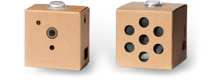

# HR CMGT Machine Learning

## What is Machine Learning?

- [Introduction](./workshop/introduction.md)
- [Workshop](./workshop/workshop.md)

## Machine Learning Problems

- [Examples of Machine Learning problems](#disciplines)
- [Coding with Javascript](#javascript)

## Learning

- [Python](#python)
- [Reading list](#readinglist)
- [Demos and tutorials](#examples)
- [Community](#community)
- [Datasets](#datasets)
- [More tools and services](#services)

<br>

# <a name="disciplines"></a>Examples of machine learning problems


Depending on your data and your goal, you can use different approaches for your Javascript ML project.

| Problem                                | Approach                                                                                              | Javascript example                               |
|-------------------------------------|-------------------------------------------------------------------------------------------------------|--------------------------------------------------|
| Find patterns in a simple excel sheet   | Use K-Nearest-Neighbour to find patterns in arrays of numbers                                         | [kNear](https://github.com/NathanEpstein/KNear), [KNNClassifier](https://ml5js.org/reference/api-KNNClassifier/)                             |
| Find patterns in a complex excel sheet  | Use a basic Neural Network to find patterns in arrays of numbers                                      | [brainJS](https://github.com/BrainJS/brain.js#for-training-with-neuralnetwork), [ML5 Neural Network](https://learn.ml5js.org/docs/#/reference/neural-network), [Tensorflow Basics](https://www.tensorflow.org/js/tutorials/training/linear_regression)             |
| Understand meaning of text | Use LSTM Neural Network or Word2Vec to find meaning in sentences                                      | [BrainJS LSTM](https://github.com/BrainJS/brain.js#for-training-with-rnn-lstm-and-gru), [Word2Vec](https://learn.ml5js.org/docs/#/reference/word2vec)                                |
| Understand sentiment in text | Use existing sentiment model                                      | [ML5 sentiment](https://ml5js.org/reference/api-Sentiment/), [TensorFlow sentiment](https://github.com/tensorflow/tfjs-examples/tree/master/sentiment), [Detect Comment Toxicity](https://storage.googleapis.com/tfjs-models/demos/toxicity/index.html)                                |
| Recognise body poses                | Use an existing pre-trained body pose model                                                           | [Train a Pose Model with Teachable Machine](https://teachablemachine.withgoogle.com) [ML5 PoseNet](https://learn.ml5js.org/docs/#/reference/posenet)                                    |
| Recognise objects in images         | Use an existing pre-trained image model, or train your own model using a Convolutional Neural Network | [Train a model with Teachable Machine](https://teachablemachine.withgoogle.com), [ML5 YOLO](https://learn.ml5js.org/docs/#/reference/yolo), [Tensorflow Object Detection](https://github.com/tensorflow/tfjs-examples/tree/master/simple-object-detection)            |
| Recognise hand written text         | Use the MNIST model | [Tensorflow MNIST](https://github.com/tensorflow/tfjs-examples/tree/master/mnist)            |
| Recognise facial expressions        | Use an existing facial expression model                                                   | [Face-API](https://github.com/justadudewhohacks/face-api.js) |
| Generate text or images             | Use a Recurrent Neural Network                                                                        | [ML5 Sketch RNN](https://learn.ml5js.org/docs/#/reference/sketchrnn), [BrainJS RNN](https://github.com/BrainJS/brain.js#for-training-with-rnn-lstm-and-gru)                              |


---
<br>
<br>


# <a name="javascript"></a>Coding with Javascript

Javascript allows us to publish our projects online, and provides easy ways to visualise our results using html and css.

## Brain.JS

[BrainJS](https://github.com/BrainJS/brain.js) is a library that allows you to instantiate a Neural Network, train it and run a classification in just a few lines of code. This example learns if text on a RGB background should be white or black:

```javascript
const net = new brain.NeuralNetwork()

net.train([
  { input: { r: 0.03, g: 0.7, b: 0.5 }, output: { black: 1 } },
  { input: { r: 0.16, g: 0.09, b: 0.2 }, output: { white: 1 } },
  { input: { r: 0.5, g: 0.5, b: 1.0 }, output: { white: 1 } },
])

const output = net.run({ r: 1, g: 0.4, b: 0 }) // { white: 0.99, black: 0.002 }
```

- [Source code and examples for BrainJS](https://github.com/BrainJS/brain.js)
- [Youtube BrainJS introduction](https://www.youtube.com/watch?v=RVMHhtTqUxc)
- [Recognise letters](https://github.com/BrainJS/brain.js/blob/master/examples/which-letter-simple.js)
- [Recognise a drawing](https://output.jsbin.com/mofaduk) and [code](https://gist.github.com/mac2000/fc54e6d6bdcbfde28b03dc2a43611270)
- [Live code example using table data](https://scrimba.com/c/c36zkcb)

## ML5.JS

ML5 supplies a simplified wrapper with clear documentation and examples for many existing Machine Learning libraries, such as TensorFlow and YOLO. In this example, we teach the machine what is left and what is right:

```javascript
let nn = ml5.neuralNetwork({
  inputs: 1,
  outputs: 2,
  task: 'classification',
  debug: true
})

nn.addData( 100,  ['left'])
nn.addData( 600,  ['right'])
nn.addData( 150,  ['left'])
nn.addData( 800,  ['right'])

nn.normalizeData()
nn.train(finishedTraining)

function finishedTraining(){
  nn.classify([160], (err, result) => console.log(result)) // LEFT
}
```

- [Introduction to the ML5 library](https://ml5js.org)
- [ML5 Neural Network](https://learn.ml5js.org/docs/#/reference/neural-network)
- [ML5 Image Recogition](https://learn.ml5js.org/docs/#/reference/yolo)
- [ML5 Pose Recogition](https://learn.ml5js.org/docs/#/reference/posenet)


## Tensorflow JS

TensorFlow is Google's Neural Network library. TensorFlow is available for Javascript, Python and IoT devices. In TensorFlow you can build your own custom Neural Network to serve many different purposes.

- [Tensorflow for Javascript](https://www.tensorflow.org/js/)
- [Load an existing model and classify an image in 3 lines of code](./workshop/workshop3.md)
- [Tensorflow JS Tutorials](https://www.tensorflow.org/js/tutorials)
- [Tensorflow Neural Network](https://codelabs.developers.google.com/codelabs/tfjs-training-regression/index.html#0)
- [Hello World in Tensorflow.JS](https://meowni.ca/posts/hello-tensorflow/)
- [Audio example](https://codelabs.developers.google.com/codelabs/tensorflowjs-audio-codelab/), [Webcam example](https://codelabs.developers.google.com/codelabs/tensorflowjs-teachablemachine-codelab/index.html)
- [Apply Anime Drawing Style on your images](https://leemeng.tw/generate-anime-using-cartoongan-and-tensorflow2-en.html)
- [Detect toxicity in online comments](https://storage.googleapis.com/tfjs-models/demos/toxicity/index.html)

<br>
<br>

---
# <a name="python"></a>Python


- [Read more about programming with Python, TensorFlow, Raspberry Pi and microcontrollers](./python.md)

# <a name="readinglist"></a>Reading list


- [🔥 Brilliant.org interactive quiz about Neural Networks](https://brilliant.org/courses/artificial-neural-networks/)
- [📺 The Coding Train](https://thecodingtrain.com)
- [📺 Crash Course - what is AI?](https://www.youtube.com/watch?v=a0_lo_GDcFw)
- [Machine Learning for Everyone](https://vas3k.com/blog/machine_learning/)
- [The Mostly Complete Chart of Neural Networks](https://towardsdatascience.com/the-mostly-complete-chart-of-neural-networks-explained-3fb6f2367464)
- [Introduction to Deep Learning](https://media.ccc.de/v/35c3-9386-introduction_to_deep_learning)
- [More algorithms for Machine Learning](https://towardsdatascience.com/a-tour-of-the-top-10-algorithms-for-machine-learning-newbies-dde4edffae11)
- [Neural Networks Wiki page](https://en.wikipedia.org/wiki/Artificial_neural_network)
- [Machine Learning for Humans](https://medium.com/machine-learning-for-humans/why-machine-learning-matters-6164faf1df12)
- [Machine Learning for designers](http://www.oreilly.com/design/free/machine-learning-for-designers.csp)
- [A visual introduction to Machine Learning](http://www.r2d3.us/visual-intro-to-machine-learning-part-1/)
- [Deep learning book](http://www.deeplearningbook.org)
- [Researching the use of ML in creative applications](http://blog.otoro.net)
- [Design in the era of the algorithm](https://bigmedium.com/speaking/design-in-the-era-of-the-algorithm.html)
- [Human-Centered Machine Learning](https://medium.com/google-design/human-centered-machine-learning-a770d10562cd)
- [The UX of AI (Google Design)](https://design.google/library/ux-ai/)
- [Maths for Programmers](https://www.freecodecamp.org/news/beaucarnes/maths-for-programmers--09iy8H6lC)
- [Mastering Machine Learning with MatLab for Python](https://nl.mathworks.com/campaigns/offers/mastering-machine-learning-with-matlab.html?s_eid=PSB_17921)
- [Deep Learning Simplified - Youtube series](https://www.youtube.com/playlist?list=PLjJh1vlSEYgvGod9wWiydumYl8hOXixNu)
- [Neural Networks and Deep Learning](http://neuralnetworksanddeeplearning.com)
- [Machine Learning for Kids](https://machinelearningforkids.co.uk/)
- [Deep Learning Gone Wrong - How ML expectations don't always match with results](https://docs.google.com/spreadsheets/u/1/d/e/2PACX-1vRPiprOaC3HsCf5Tuum8bRfzYUiKLRqJmbOoC-32JorNdfyTiRRsR7Ea5eWtvsWzuxo8bjOxCG84dAg/pubhtml)


# <a name="community"></a>Community

- [AI Stackoverflow](https://ai.stackexchange.com)
- [Kaggle - Machine Learning challenges](https://www.kaggle.com)

# <a name="datasets"></a>Datasets

- [Google Dataset Search](https://datasetsearch.research.google.com) 
- [🐱 Cats per square kilometer](https://data.gov.uk/dataset/9d475e06-3885-4a90-b8c0-77fea13f92e6/cats-per-square-kilometre)
- [Kaggle Datasets](https://www.kaggle.com/datasets/)
- [TensorflowJS Dataset examples](https://github.com/tensorflow/tfjs-models)

# <a name="demos"></a>Demos and tutorials

<a href="https://playground.tensorflow.org" target="_blank"></a>

- [Tensorflow Playground](https://playground.tensorflow.org) 😱
- [Coding a perceptron in Javascript, by Mathias P Johansson](https://youtu.be/o98qlvrcqiU), and the [result](https://beta.observablehq.com/@mpj/neural-network-from-scratch-part-1)
- [Creating a Recommender System in Javascript](https://github.com/javascript-machine-learning/movielens-recommender-system-javascript) and in [Python](https://towardsdatascience.com/how-to-build-a-simple-recommender-system-in-python-375093c3fb7d)
- [Using a Javascript Perceptron to classify dangerous snakes](https://github.com/elyx0/rosenblattperceptronjs)
- [Classify an image in 5 lines of Javascript](https://codepen.io/eerk/pen/JmKQLw)
- [Train a Train - small game where a vehicle learns to drive](https://github.com/lkoppenol/train-a-train)
- [Teleport Vision - analyse UI sketches to generate HTML](https://github.com/teleporthq/teleport-vision-api)
- [Neural Drum Machine](https://codepen.io/teropa/pen/JLjXGK) and [Voice-based beatbox](https://codepen.io/naotokui/pen/NBzJMW) created with [MagentaJS](https://magenta.tensorflow.org)
- [Demo for creating a self-learning Flappy Bird in Javascript](https://github.com/ssusnic/Machine-Learning-Flappy-Bird)
- [Algorithm notes](http://books.goalkicker.com/AlgorithmsBook/)
- [Google AI experiments](https://experiments.withgoogle.com/ai)
- [Building a cat detector on a Raspberry Pi](https://planb.nicecupoftea.org/2018/12/01/cat-detector-with-tensorflow-on-a-raspberry-pi-3b/)
- [Quick Draw! - Can a Neural Network detect a doodle?](https://quickdraw.withgoogle.com) and the [open source drawing dataset](https://github.com/googlecreativelab/quickdraw-dataset/)
- [Runway - An app that adds ML to creative projects](https://runwayapp.ai)
- [Pixling - Building a life simulation app with Neural Networks](http://wiki.pixling.world/index.php/Main_Page)
- [Imagine drawing a cat!](http://projects.eerkmans.nl/cat/)
- [Building a self-driving Mario Kart using TensorFlow](https://www.youtube.com/watch?v=Ipi40cb_RsI) and [documentation](https://www.youtube.com/redirect?q=https%3A%2F%2Fdocs.google.com%2Fdocument%2Fd%2F1p4ZOtziLmhf0jPbZTTaFxSKdYqE91dYcTNqTVdd6es4%2Fedit%3Fusp%3Dsharing&event=video_description&v=Ipi40cb_RsI&redir_token=Ybzxsbpmjb-vKOmpvcRlyEses5V8MTUxMzMzODkwNUAxNTEzMjUyNTA1)
- [Learning Neural Networks with Processing](https://natureofcode.com/book/chapter-10-neural-networks/)

<br>
<br>

# <a name="services"></a>More tools and services

## Runway ML


[Machine learning for creators](https://runwayml.com) - bring the power of artificial intelligence to your creative projects with an intuitive and simple visual interface.

## Games

- [OpenAI GYM - a game environment to train AI](http://gym.openai.com)
- [Unity Machine Learning Platform](https://unity3d.com/machine-learning)
- [Dr. Derk's mutant battlegrounds](https://store.steampowered.com/app/1102370/Dr_Derks_Mutant_Battlegrounds/)
- [AI Dungeon](https://play.aidungeon.io)
- [Control a ThreeJS game with Teachable Machine](https://github.com/charliegerard/whoosh)

## Image recognition

- [TrackingJS, an image recognition library for Javascript](https://trackingjs.com)
- [YOLO - you only look once](https://pjreddie.com/darknet/yolo/) Image recognition network, watch the cool [intro movie!](https://www.youtube.com/watch?v=MPU2HistivI)
- [Vize.ai Recognize and automate your images](https://vize.ai)
- [ImageNet - readymade training data for image recognition](http://www.image-net.org)
- [OpenCV Computer Vision](https://opencv.org)

## Language and speech

- [Listen to speech with Javascript](https://developer.mozilla.org/en-US/docs/Web/API/Web_Speech_API/Using_the_Web_Speech_API)
- [Understand sentiment in text](https://ml5js.org/reference/api-Sentiment/)
- [Understand meaning of text](./workshop/lesson-smarthome/readme.md)
- [What are word vectors?](https://gist.github.com/aparrish/2f562e3737544cf29aaf1af30362f469)
- [Understanding Word2Vec Video by Daniel Shiffman](https://youtu.be/MOo9iJ8RYWM)
- [Natural Language Processing with Spacy.io](https://spacy.io)
- [Google TacoTron Self-learning Speech Synthesizer](https://github.com/keithito/tacotron)
- [Pocket Sphynx Speech Recognition](https://github.com/cmusphinx/pocketsphinx)



- [Google's Do-it-yourself Raspberry Pi AI Kits](https://aiyprojects.withgoogle.com/vision/)
- [Microsoft Machine Learning APIs](https://gallery.azure.ai/machineLearningAPIs)
- [Apple Core ML framework](https://developer.apple.com/documentation/coreml) and [tutorials](https://developer.apple.com/machine-learning/)
- [Amazon Deep Racer](https://aws.amazon.com/deepracer/), [Machine Learning API's](https://aws.amazon.com/machine-learning/) and [Free Course](https://aws.amazon.com/training/learning-paths/machine-learning/)
- [Add Machine Learning power to a Raspberry Pi with the Intel ML USB stick](https://www.movidius.com/news/intel-movidius-neural-compute-stick-honored-with-ces-best-of-innovation-award-2018)
- [Wekinator](http://www.wekinator.org) is a GUI that can apply Machine Learning algorithms to Processing and Arduino sensor data. 
- [Wekinator workshop by Kars Alfrink](https://github.com/karsalfrink/useless-butler)
- [Magenta](https://magenta.tensorflow.org/get-started/#magenta-js) is a google library that uses tensorflow to generate [images](https://tensorflow.github.io/magenta-js/image/index.html), [music](https://tensorflow.github.io/magenta-js/music/index.html) and [sketches](https://tensorflow.github.io/magenta-js/sketch/). 
- [Tutorial on drawing snowflakes with a Neural Network and Magenta](https://youtu.be/pdaNttb7Mr8)
- [Synaptic JS Neural Networks](http://caza.la/synaptic/) and [Tutorial](https://medium.freecodecamp.org/how-to-create-a-neural-network-in-javascript-in-only-30-lines-of-code-343dafc50d49)


---


[https://xkcd.com/1925/](https://xkcd.com/1925/)
