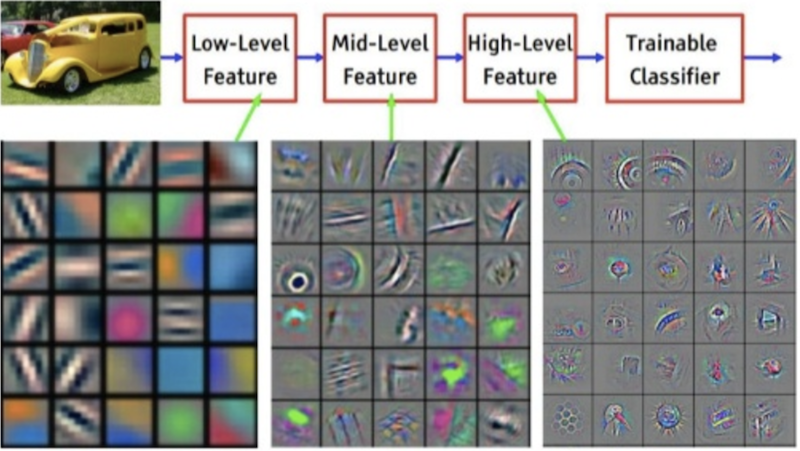

# Train your own image recognition with the Feature Extractor

If you used the [ML5 ImageClassifier](https://learn.ml5js.org/#/reference/image-classifier) you may have noticed it doesn't always recognise what you want it to recognise. Using the [Feature Extractor](https://learn.ml5js.org/#/reference/feature-extractor) we can re-train the model to recognise your own images.

<br>
<br>
<br>

## Feature extraction



This term means we use a model that has learned **HOW** to look at images. It finds the most important defining features. With this knowledge, it can find the distinguishing features in our own images as well.

[Watch this super cool visualisation of feature extraction](https://www.youtube.com/watch?v=f0t-OCG79-U)

<br>
<br>
<br>

# ML5

Example code

 1 - Training with the webcam: use the webcam to capture images of what you want to learn. Then use the webcam to start classifying what it sees.
 2 - Training with static images from a folder. Then classify a new static image.
 3 - Saving and loading the model
 4 - Regression instead of classification

<br>
<br>
<br>

## Training and classifying with webcam

First include ML5, and include a video tag in your html

```html
<script src="https://unpkg.com/ml5@0.4.3/dist/ml5.min.js"></script>
<video autoplay playsinline muted id="webcam" width="533" height="300"></video>
```
In javascript, switch on the webcam with
```javascript
if (navigator.mediaDevices.getUserMedia) {
    navigator.mediaDevices.getUserMedia({ video: true })
        .then((stream) => {
            video.srcObject = stream
        })
        .catch((err) => {
            console.log("Something went wrong!");
        });
}
```
<br>
<br>
<br>

### Add training data

Create the featureExtractor, then in the `onloaded` callback you can create the classifier. 

```javascript
const featureExtractor = ml5.featureExtractor('MobileNet', modelLoaded)
const video = document.getElementById('webcam')
function modelLoaded() {
    console.log('Model Loaded!')
    classifier = featureExtractor.classification(video, videoReady)
}
function videoReady(){
    console.log("the webcam is ready")
}
```
Create buttons for all your labels in your HTML page.
```html
<button id="mask">Wearing a mask</button>
```
When you click a button, you can add the current webcam image with that label as a training image:
```javascript
const maskbtn = document.getElementById("mask")
maskbtn.addEventListener("click", () => addMaskImage())

function addMaskImage() {
    classifier.addImage(video, 'wearing a mask', ()=>{
        console.log("added image to model!")
    }))
}
```
The callback is just to check if the image was succesfully added to the model.

<br>
<br>
<br>

### Training

After adding about 10-20 images for each label, you can call the training function. The loss value should be getting smaller while your network is learning.
```javascript
classifier.train((lossValue) => {
    console.log('Loss is', lossValue)
    if(lossValue == null) console.log("Finished training")
})
```
<br>
<br>
<br>

### Classifying

When the lossvalue becomes `null`, you can start an interval that checks the webcam every second
```javascript
label = document.getElementById("label")

setInterval(()=>{
    classifier.classify(video, (err, result) => {
        if (err) console.log(err)
        console.log(result)
        label.innerHTML = result[0].label
    })
}, 1000)
```

<br>
<br>
<br>

## Training with folder of static images

First you can add an image to your HTML or create it by javascript using `new Image()`.

```html


```
In this example we have a folder with numbered images: `data/train1.jpg, data/train2.jpg, data/train3.jpg`. We create a variable `index` to keep track of which image we're learning.

Then we load numbered images from a folder one by one. After one image has been loaded (you can check that with an `eventListener`), we call the `addImage` function to add the image to the feature extractor.

```javascript
const featureExtractor = ml5.featureExtractor('MobileNet', modelLoaded)
const classifier = featureExtractor.classification()

let index = 1
let img = document.getElementById('trainme')

function modelLoaded(){
    loadImage()
}

function loadImage(){
    img.src = `data/train${index}.jpg`
    img.addEventListener("load", addImage())
}
```

The `addImage` function adds the image to the feature extractor. We have to wait until that also finishes, and then we can add the next image from the folder. We do that by incrementing the `index` by 1. If there are still images left, we call the `loadImage` function again.

⚠️ When adding the image to the feature extractor, we supply the label. This is what we want to learn to recognise. In this case it's a pikachu.

```javascript
function addImage(){
    classifier.addImage(img, 'pikachu', imageAdded);
}
function imageAdded(){
    if(index < 20){
       loadImage()
    } else {
        train()
    }
}
```

After all images from the folder have been added, we can call the `train` function and start classifying new images!

```javascript
function train(){
    classifier.train((lossValue) => {
        if(lossValue == null){
            classify()
        }
     });
}
function classify(){
    classifier.classify(document.getElementById('classifyme'), (err, result) => {
        console.log(result); // Should output 'pikachu'
    });
}

```

<br>
<br>
<br>

## Saving and loading the trained model

You don't want to `train()` a model every time a user starts an app. [Use the ML5 save and load options to load your own trained model](https://learn.ml5js.org/docs/#/reference/feature-extractor?id=save). 

<br>
<br>
<br>

## Regression

Instead of classifying an image into class A,B or C, you might want to get a value from 0 to 100. For example, to assess how damaged a car door is.

[regression](https://learn.ml5js.org/docs/#/reference/feature-extractor?id=regression) and [prediction](https://learn.ml5js.org/docs/#/reference/feature-extractor?id=predict)

<br>
<br>
<br>

---

## Links

- [ML5.JS](https://ml5js.org/)
- [ML5 Feature Extractor documentation](https://learn.ml5js.org/docs/#/reference/feature-extractor)
- [ML5 Plain Javascript example code](https://github.com/ml5js/ml5-library/tree/main/examples/javascript/FeatureExtractor/FeatureExtractor_Image_Classification)
- [Coding Train Tutorial Feature Extractor](https://www.youtube.com/watch?v=eeO-rWYFuG0)

