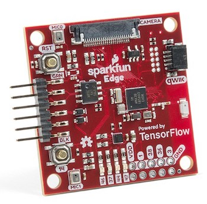

# Python

[Python](https://www.python.org) is used by data scientists and in many Machine Learning courses online. Many algorithms and libraries are available in Python that may not always be available in Javascript. The big disadvantage of Python is that the code runs only in your own environment. You can still use Python to train a model, which you can then load in a Javascript frontend. Also, you can run a Python app "live" on a raspberry Pi.

You can set up Python locally, but it's far easier to run a Jupyter Notebook in [Google Colab](https://colab.research.google.com/notebooks/intro.ipynb#recent=true), which also uses Google's GPU for heavy calculations.

[🤯 Jupyter notebooks can also run inside Visual Studio Code](https://code.visualstudio.com/docs/python/data-science-tutorial)

Python can run on a Raspberry Pi and on several Adafruit Microcontrollers. You can even use TensorFlow LITE on microcontrollers.

## Algorithms in Python

- [Creating your first neural network in Python](https://www.analyticsindiamag.com/how-to-create-your-first-artificial-neural-network-in-python/)
- [Machine learning for artists: guides and examples](http://ml4a.github.io/guides/)
- [Building a perceptron from scratch](https://medium.com/@ismailghallou/build-your-perceptron-neural-net-from-scratch-e12b7be9d1ef) and [source code](https://github.com/smakosh/Perceptron-neural-net-from-scratch)
- [Creating a perceptron in 9 lines of Python](https://medium.com/technology-invention-and-more/how-to-build-a-simple-neural-network-in-9-lines-of-python-code-cc8f23647ca1)
- [Excellent video tutorial for the Perceptron](https://www.youtube.com/watch?v=kft1AJ9WVDk)
- [Visualising data with Matplotlib](https://matplotlib.org/3.1.1/tutorials/index.html)
- [Data Science Handbook](https://jakevdp.github.io/PythonDataScienceHandbook/)

## Online courses

- [Linear Regression course on Codecademy](https://www.codecademy.com/learn/linear-regression-mssp) and [Youtube explanation](https://www.youtube.com/watch?v=2htO1YFkpds&t=311s)
- [Udacity course: Machine Learning with Python](https://www.udacity.com/course/intro-to-machine-learning--ud120)
- [Mastering Machine Learning with MatLab for Python](https://nl.mathworks.com/campaigns/offers/mastering-machine-learning-with-matlab.html?s_eid=PSB_17921)

### Science Kit Learn

- [SKLearn](http://scikit-learn.org/stable/)
- [Introduction to machine learning with scikit-learn](http://scikit-learn.org/stable/tutorial/basic/tutorial.html#machine-learning-the-problem-setting)

### Tensorflow

- [Google Tensorflow tutorials](https://www.tensorflow.org/tutorials/)
- [Getting Started with TensorFlow](https://www.tensorflow.org/get_started/get_started)
- [Get started with Tensorflow Lite for microcontrollers](https://www.tensorflow.org/lite/)

## Hardware

- [Building camera detection on a raspberry pi](https://www.youtube.com/watch?v=2kO8ScrqikM)
- [Adafruit testing Tensorflow on a microcontroller](https://www.youtube.com/watch?v=4wC2jVvGSXs)
- [Machine Learning for physical computing by Yining Shi](https://github.com/yining1023/Machine-Learning-for-Physical-Computing)
- [Google's Do-it-yourself Raspberry Pi AI Kits](https://aiyprojects.withgoogle.com/vision/)

## Links

- [StreamLit deploys python data online as a web app](https://streamlit.io)
- [Advance face position detection](https://github.com/1adrianb/face-alignment)
