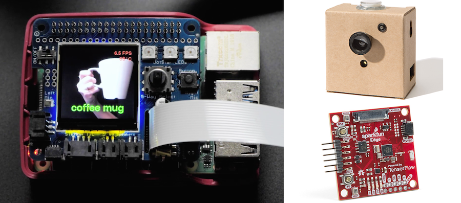
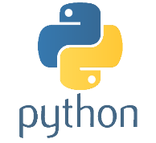

## Hardware, Python en Games

- Hardware
- Python
- Games

 
 
 

# Hardware

- [🔥 Teachable Machine Tiny Model for IoT](https://teachablemachine.withgoogle.com/train/tiny_image)
- [Tensorflow Lite - Model Maker](https://www.tensorflow.org/lite/guide/model_maker) quickly creates a model for your custom data
- [Adafruit Raspberry kit for Microsoft Lobe](https://www.adafruit.com/product/4963)
- [Jetson NANO](https://developer.nvidia.com/embedded/jetson-nano-developer-kit)
- [Braincraft AI kit for Raspberry Pi](https://learn.adafruit.com/adafruit-braincraft-hat-easy-machine-learning-for-raspberry-pi)
- [Arduino edge impulse for AI applications](https://docs.arduino.cc/tutorials/nano-33-ble-sense/edge-impulse)
- [🔥 Mycroft is a private smart home assistant](https://mycroft.ai) - no need to send your voice data to google, apple or amazon!
- [Wekinator](http://www.wekinator.org) is a GUI that can apply Machine Learning to Arduino sensor data - [check the tutorial.](http://www.wekinator.org/kadenze/)
- [Using Node.JS for tensorflow](https://www.tensorflow.org/js/guide/nodejs)
- [Use Node.JS and tensorflow on the Raspberry Pi with draggable blocks](https://www.youtube.com/watch?v=cZj1d25eeWY)
- [Google's Do-it-yourself Raspberry Pi AI Kits](https://aiyprojects.withgoogle.com/vision/)
- [Edge microcontroller can run TensorFlow Lite](https://www.sparkfun.com/products/15170) from SparkFun
- [Corel.AI Tensorflow Hardware](https://coral.ai/products/) en [📺 Marshmallow detector demo](https://coral.ai/projects/teachable-sorter/)
- [Build a teachable robot with Raspberry Pi and Arduino](https://experiments.withgoogle.com/alto)
- [📺 Simple demo to recognise speech with Raspberry](https://www.youtube.com/watch?v=7ercdl9YC1o) and [tutorial](https://learn.adafruit.com/how-to-train-new-tensorflow-lite-micro-speech-models?view=all)
- [Building camera detection on a raspberry pi](https://www.youtube.com/watch?v=2kO8ScrqikM)
- [Adafruit testing Tensorflow on a microcontroller](https://www.youtube.com/watch?v=4wC2jVvGSXs)
- [Machine Learning for physical computing by Yining Shi](https://github.com/yining1023/Machine-Learning-for-Physical-Computing)
- [Google's Do-it-yourself Raspberry Pi AI Kits](https://aiyprojects.withgoogle.com/vision/)

 
 
 

# Python

[Python](https://www.python.org) is used by data scientists and in many Machine Learning courses online. Many algorithms and libraries are available in Python that may not always be available in Javascript. The big disadvantage of Python is that the code runs only in your own environment. You can still use Python to train a model, which you can then load in a Javascript frontend. Also, you can run a Python app "live" on a raspberry Pi.

You can set up Python locally, but it's far easier to run a Jupyter Notebook in [Google Colab](https://colab.research.google.com/notebooks/intro.ipynb#recent=true), which also uses Google's GPU for heavy calculations.

[🤯 Jupyter notebooks can also run inside Visual Studio Code](https://code.visualstudio.com/docs/python/data-science-tutorial)

 

## Python code examples

- [Creating your first neural network in Python](https://www.analyticsindiamag.com/how-to-create-your-first-artificial-neural-network-in-python/)
- [Machine learning for artists: guides and examples](http://ml4a.github.io/guides/)
- [Building a perceptron from scratch](https://medium.com/@ismailghallou/build-your-perceptron-neural-net-from-scratch-e12b7be9d1ef) and [source code](https://github.com/smakosh/Perceptron-neural-net-from-scratch)
- [Creating a perceptron in 9 lines of Python](https://medium.com/technology-invention-and-more/how-to-build-a-simple-neural-network-in-9-lines-of-python-code-cc8f23647ca1)
- [Generating recipes with LSTM with cooking dataset](https://dev.to/trekhleb/generating-cooking-recipes-using-tensorflow-and-lstm-recurrent-neural-network-a-step-by-step-guide-973)
- [Excellent video tutorial for the Perceptron](https://www.youtube.com/watch?v=kft1AJ9WVDk)
- [Visualising data with Matplotlib](https://matplotlib.org/3.1.1/tutorials/index.html)
- [Data Science Handbook](https://jakevdp.github.io/PythonDataScienceHandbook/)
- [Train a Train - small game where a vehicle learns to drive](https://github.com/lkoppenol/train-a-train)
- [Building a cat detector on a Raspberry Pi](https://planb.nicecupoftea.org/2018/12/01/cat-detector-with-tensorflow-on-a-raspberry-pi-3b/)
- [NVidia AI playground](https://www.nvidia.com/en-us/research/ai-playground/)
- [Recommender System](https://towardsdatascience.com/how-to-build-a-simple-recommender-system-in-python-375093c3fb7d)
- [Algorithm notes](http://books.goalkicker.com/AlgorithmsBook/)
- what is [YOLO?](https://www.youtube.com/watch?v=MPU2HistivI)
  
 
 
 
  
## Generative AI
  
- [Play with Stable Diffusion on your own Google Colab](https://colab.research.google.com/drive/154esJFzO2_rw309Js30EmrseQ0269kgj?usp=sharing)

 
 
 
  
  
## Online courses

- [Linear Regression course on Codecademy](https://www.codecademy.com/learn/linear-regression-mssp) and [Youtube explanation](https://www.youtube.com/watch?v=2htO1YFkpds&t=311s)
- [Udacity course: Machine Learning with Python](https://www.udacity.com/course/intro-to-machine-learning--ud120)
- [Mastering Machine Learning with MatLab for Python](https://nl.mathworks.com/campaigns/offers/mastering-machine-learning-with-matlab.html?s_eid=PSB_17921)

### Science Kit Learn

- [SKLearn](http://scikit-learn.org/stable/)
- [Introduction to machine learning with scikit-learn](http://scikit-learn.org/stable/tutorial/basic/tutorial.html#machine-learning-the-problem-setting)

### Tensorflow

- [Google Tensorflow tutorials](https://www.tensorflow.org/tutorials/)
- [Getting Started with TensorFlow](https://www.tensorflow.org/get_started/get_started)
- [Get started with Tensorflow Lite for microcontrollers](https://www.tensorflow.org/lite/)

 
 
 

# Games

- [Getting started with ML Agents in Unity](./unity.md)
- [Unity Learn: ML Agents Course](https://learn.unity.com/course/ml-agents-hummingbirds)
- [AI learns how to play Tic-Tac-Toe with Genetic Algorithms](https://blog.paperspace.com/tic-tac-toe-genetic-algorithm-part-1/)
- [Tensorflow Agent learns how to play a game](https://www.youtube.com/watch?v=52DTXidSVWc)
- [OpenAI GYM - a game environment to train AI with Python](http://gym.openai.com)
- [Self-driving car in Unity](https://github.com/udacity/self-driving-car-sim) and [Udacity Course: become a self-driving car engineer](https://www.udacity.com/course/self-driving-car-engineer-nanodegree--nd0013)
