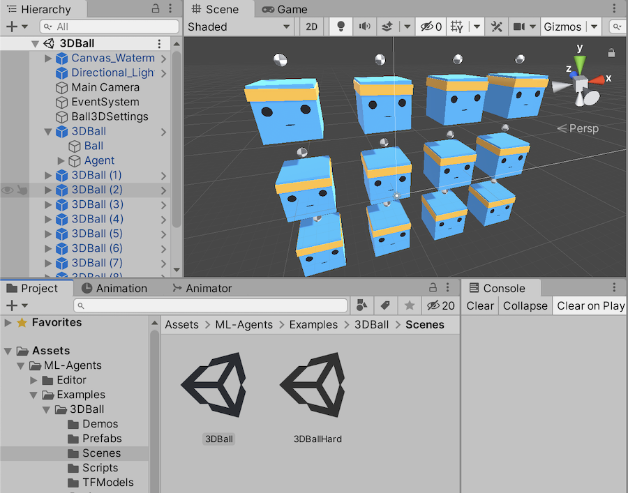
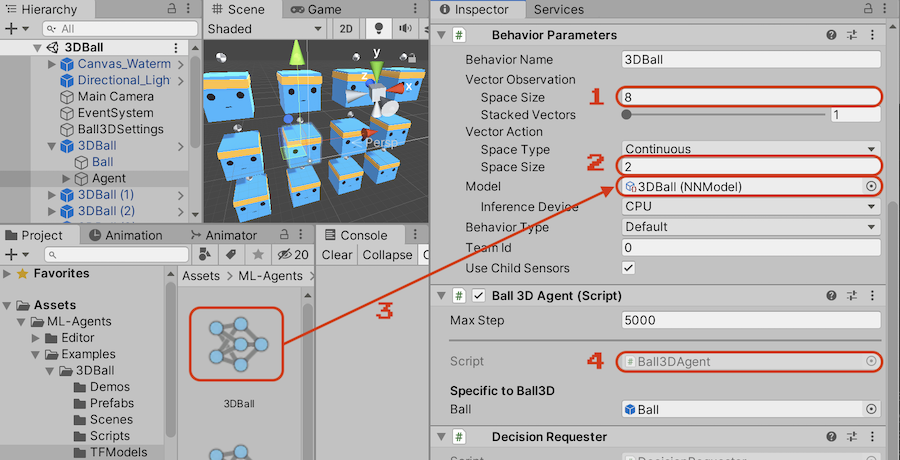
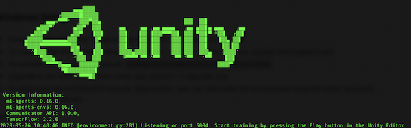

# Machine Learning in Unity

- Unity Examples
- Training with Python
- Documentation



## Open the examples

Download the [example project](https://github.com/Unity-Technologies/ml-agents). Open Unity Hub, click ADD. Then, choose the **project** folder inside the **ml-agents** folder that you just downloaded.

In the Unity project window, choose Examples > 3DBall > Scenes > 3DBall. This should look like the screenshot above ⬆️. Press play to see the robots balancing the ball on their heads.

## Agent Component

Click the **Agent** game component in 3DBall. The agent will will learn from robot position, ball position and ball speed to keep the ball on its head.

🧠 Note that the project window contains a folder called **TFModels**. These are our robot brains! 



 1. We have 8 Neural Network Inputs - cube position, ball position, ball speed
 2. We have 2 Neural Network Outputs - cube x rotation, cube z rotation
 3. The trained model will give us output, based on input
 4. The script that translates the neural network output to unity actions.

## Script

The script has to do the following things:

- Set up the start position of the game objects
- Specify the 8 inputs and 2 outputs
- Give a reward for correct behaviour

```c
public class Ball3DAgent : Agent
{
    public override void CollectObservations(VectorSensor sensor)
    {
        // INPUT
        // Robot rotation (x, z), Ball position (x, y, z) and ball speed (x, y, z).
        sensor.AddObservation(gameObject.transform.rotation.z);
        sensor.AddObservation(gameObject.transform.rotation.x);
        sensor.AddObservation(ball.transform.position - gameObject.transform.position);
        sensor.AddObservation(m_BallRb.velocity);
    }

    public override void OnActionReceived(float[] vectorAction)
    {
        // OUTPUT
        // New robot rotation (x, z)
        var actionZ = 2f * Mathf.Clamp(vectorAction[0], -1f, 1f);
        var actionX = 2f * Mathf.Clamp(vectorAction[1], -1f, 1f);

        if (ball.transform.position.y - gameObject.transform.position.y || ...)
        {
            // PENALTY - if ball has fallen       
            SetReward(-1f); 
            EndEpisode();
        }
        else
        {
            // REWARD - ball still on head
            SetReward(0.1f);
        }
    }
}
```

# Training with Python

The demo project contains pre-trained models. To train models yourself, you need to install Python, and the python **mlagents** tool. You also need to create a virtual environment. 

- [Install python 3](https://www.python.org/downloads/)
- [⚠️ Make a virtual environment for using Unity with Python](https://github.com/Unity-Technologies/ml-agents/blob/release_1/docs/Using-Virtual-Environment.md)

Open a terminal and *switch to your virtual python environment*. The name of the virtual environment should appear in brackets in the terminal prompt.

```
source ~/python-envs/my-cool-env/bin/activate   // MAC OS X
python-envs\my-cool-env\Scripts\activate        // WINDOWS
```
In the virtual environment you can install the mlagents tool:

```
(unity-env) pip3 install mlagents
```
You can start the **mlagents** tool using a config.yaml file. This file contains all the settings for your neural network. There's an example yaml file in the example folder.

- Open a terminal in the github repository that you downloaded
- Make sure you are in the virtual environment *(note the brackets with the environment name)*
- Use the **mlagents-learn** command to start training!

```bash
(unity-env) mlagents-learn config/trainer_config.yaml --run-id=ErikTest
```
The terminal should look like this. In Unity, open the 3D Ball scene and press **PLAY** to start training your model! 



When the model finished training, you have a new `mymodel.nn` file, that you can use inside Unity in the same way as in the examples above.

[Continue learning about training here](https://github.com/Unity-Technologies/ml-agents/blob/release_1/docs/Getting-Started.md)

<br>

# Starting with an empty project

After installing the python tools, you can start a blank new Unity project and train your own models in your own game. 

Start a new Unity project and add the Machine Learning game components via **window > package manager > ML Agents > install**. *You need to allow "preview packages" under the "advanced" menu*. 

[Now you are ready to follow this tutorial](https://github.com/Unity-Technologies/ml-agents/blob/release_1/docs/Learning-Environment-Create-New.md)

<br>

## Links

- [Unity Machine Learning Platform](https://unity3d.com/machine-learning)
- [Unity Example Projects Repository](https://github.com/Unity-Technologies/ml-agents)
- [Getting started with training](https://github.com/Unity-Technologies/ml-agents/blob/release_1/docs/Getting-Started.md)
- [Explanation of all the examples](https://github.com/Unity-Technologies/ml-agents/blob/release_1/docs/Learning-Environment-Examples.md)

## Your own projects

- [Installation](https://github.com/Unity-Technologies/ml-agents/blob/release_1/docs/Installation.md) and [using the Python virtual environment](https://github.com/Unity-Technologies/ml-agents/blob/release_1/docs/Using-Virtual-Environment.md)
- [Starting with an empty project](https://github.com/Unity-Technologies/ml-agents/blob/release_1/docs/Learning-Environment-Create-New.md)
- [More detailed docs on ML-Agents](https://github.com/Unity-Technologies/ml-agents/blob/release_1/docs/Training-ML-Agents.md)
- [Four types of learning](https://github.com/Unity-Technologies/ml-agents/blob/release_1/docs/Background-Machine-Learning.md)