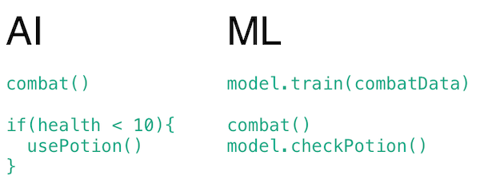
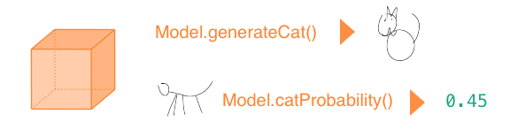
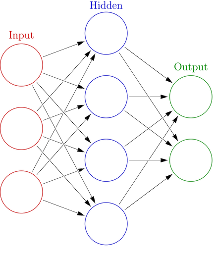

# Machine Learning

- [Introduction](#introduction)
- [Workshop](./workshop1.md)
- [Reading list](../README.md)

# <a name="introduction"></a>Introduction

#### What is Machine Learning?

Put simply, a Machine Learning project can learn from itself or from data that you provide. Instead of programming logic yourself, you will train a *model* and then let that model make decisions.

These models can often find patterns in complex data that even the smartest programmer could not have discovered. At the same time, training a model can have its own biases and preconceptions that you have to be aware of.



- Artificial Intelligence: you program a character to drink a potion once his health gets too low.
- Machine Learning: you train a model with previous combat data, and then let it decide what is the best moment to drink a health potion.

### Algorithms

A model is built using an *algorithm*. When starting a Machine Learning project, you have to look carefully at the data you have available, and the kind of result you need, so you can determine which algorithm fits that need.


*Using an algorithm to train a model to recognise cat drawings. This step is needed only once.*



*Once you have the model, you can ask to what degree a new drawing resembles a cat. Or you could even let it imagine new cat drawings!*

#### Real world application

Replace the cat images with credit card transactions, including data that mentions if the transaction was fraudulent. After training a model with this data, you can test new transactions for being fraudulent.

**model**

Train a model with **date, amount, user, location, shop** as numbers in an array. The data is labeled as **valid** or **invalid**.
```
network.train(
  [12122018, 33, 2282, 3, 55], valid
  [10212017, 24, 4343, 6, 45], valid
  [12122018, 112, 1231, 6, 12], invalid
)
```
**test a new transaction**
```
var valid = network.test([10212017, 24, 4343, 6, 45])
```

# Neural Networks



A Neural Network is inspired by the human brain. Input will flow through *neurons* in the network. Each neuron has *weights* that decide to which next neuron the data should flow. 

By training the network, these weights are calculated in such a way that each input results in the desired output. 

The number of training iterations and the number of hidden layers will determine the accuracy of the network.

- [But what *is* a neural network? - youtube](http://www.youtube.com/playlist?list=PLZHQObOWTQDNU6R1_67000Dx_ZCJB-3pi)
- [Neural networks demystified](http://lumiverse.io/series/neural-networks-demystified)

# K-Nearest-Neighbour


This algorithm uses the distance between points to classify a new point. In the above image, the green circle will be classified as red, because there are more red triangles in its vicinity.

This is essentially just the Pythagorean theorem, so it's a lot easier to understand than a Neural Network. 

The above image shows classification based on the [x,y] coordinates of a point. The magic of the KNN algorithm is that the algorithm works just as well with more than two dimensions.

In other words, we could build the credit card example using KNN, by supplying our credit card data as an array.

This algorithm is much faster than a neural network, so it may be a better fit for simpler projects!

- [K-Nearest-Neighbour in Javascript](https://github.com/NathanEpstein/KNear)
- [Webcam detector using 'K-Nearest-Neighbour'](https://github.com/KokoDoko/webcam-detectotron)

#### Using existing tools

Instead of writing algorithms yourself, you will often choose an existing library, based on your data and your expected output. Tools exist for:

- Image Recognition
- Speech Recognition
- Language Generation
- Body Pose Recognition
- And many more

## Continue

- [Workshop](./workshop1.md)
- [Reading list](../README.md)