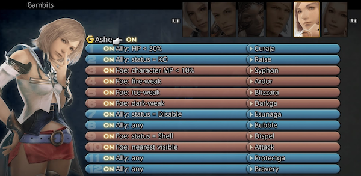
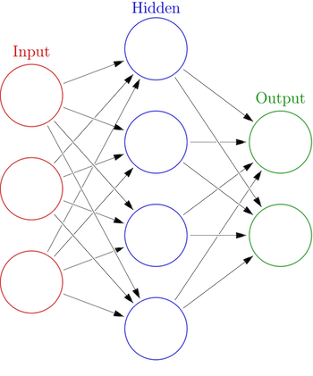
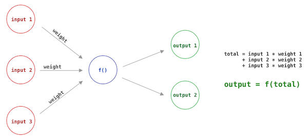

# Machine Learning

- [Introduction](#introduction)
- [Workshop](./workshop1.md)
- [Reading list](../README.md)

# <a name="introduction"></a>Introduction


[Open the Pod Bay Doors, HAL](https://www.youtube.com/watch?v=ARJ8cAGm6JE) or [Perhaps Alexa can do it?](https://www.youtube.com/watch?v=OpFIW9WoH3E)

## What is Machine Learning?

Traditional computer programs consist of a list of instructions, put together by a programmer. It is the programmer's job to find the most concise, logical set of instructions to perform a task. 



*The AI system in Final Fantasy XII shows a traditional set of instructions.*

A Machine Learning project can learn from itself or from data that you provide. Instead of programming logic yourself, you will train a *model* and then let that model make decisions. These models can often find patterns in complex data that even the smartest programmer could not have discovered. 


- Artificial Intelligence: you program a character to drink a potion once his health gets too low.
- Machine Learning: you train a model with previous combat data, and then let it decide what is the best moment to drink a health potion.

### Why do we need Machine Learning?

In the age of Big Data, it's becoming harder to find patterns and solutions using traditional programming. Machine Learning can analyse huge amounts of data.


- Medical diagnosis
- Financial analysis 
- Chatbots
- Language Translation - Japanese translation was not possible before Machine Learning
- Recommendations in shops
- [Self-driving cars](https://youtu.be/tiwVMrTLUWg?t=538)
- [Live video analysis](https://youtu.be/MPU2HistivI)
- Pose recognition (kinect)
- iPhone face ID
- Email spam detection
- [Anne Frank project](https://www.smithsonianmag.com/smart-news/investigators-are-using-big-data-analysis-find-out-who-betrayed-anne-frank-180965117/)

## Supervised learning

This workshop is about *supervised learning*. We supply the computer with *labeled data*, and then we build a *model* that allows us to label new *unknown data*.

A model is built using an *algorithm*. When starting a Machine Learning project, you have to look carefully at the data you have available, and the kind of result you need, to determine which algorithm fits that need.


*Using an algorithm to train a model to recognise cat drawings. This step is needed only once.*


*Once you have the model, you can ask to what degree a new drawing resembles a cat. Or you could even let it imagine new cat drawings!*

#### Real world application

Replace the cat images with credit card transactions, including data that mentions if the transaction was fraudulent. After training a model with this data, you can test new transactions for being fraudulent.

**model**

Train a model with **date, amount, user, location, shop** as numbers in an array. The data is labeled as **valid** or **invalid**.
```
model.train(
  [12122018, 33, 2282, 3, 55], valid
  [10212017, 24, 4343, 6, 45], valid
  [12122018, 112, 1231, 6, 12], invalid
)
```
**test a new transaction**
```
var valid = model.test([10212017, 24, 4343, 6, 45])
```

# Algorithms

There are many different algorithms and methods to create a self-learning model, for example:

- Nearest Neighbour
- Neural Networks

## Nearest Neighbour


This algorithm uses the distance between points to classify a new point. In the above image, the green circle will be classified as red, because there are more red triangles in its vicinity.

The above example will classify the green circle as RED, because there are more red triangles in its vicinity than blue squares. This classification is based on `x,y` coordinates of a point. But surprisingly, this calculation works just as well when those two numbers do not represent a physical coordinate, but for example, the number of legs and eyes of a creature.

You can imagine that this also works in three coordinates: `x,y,z`, so we can use the algorithm for datasets with three numbers. The real beauty of this algorithm is that it also works with even more than 3 coordinates.

In other words, we could build the credit card example using Nearest Neighbour, by supplying our credit card data as an array.

This algorithm is much faster than a neural network, so it may be a better fit for simpler projects!

- [K-Nearest-Neighbour in Javascript](https://github.com/NathanEpstein/KNear)
- [Webcam detector using 'K-Nearest-Neighbour'](https://github.com/KokoDoko/webcam-detectotron)

## Neural networks



A Neural Network is inspired by the human brain. Input will flow through *neurons* in the network. Each neuron has *weights* that decide to which next neuron the data should flow. 

By repeating the training (iterations), the weights are adjusted until input results in the desired output. 



- **Weight** The network starts with random weights for each input.
- **Output** The combined inputs and weights result in one of the two outputs
- **Iteration** Adjust the weights until the output matches the desired output

Links

- [Creating a single neuron in Javascript](https://youtu.be/o98qlvrcqiU)
- [Neural Network basics explained](https://media.ccc.de/v/35c3-9386-introduction_to_deep_learning)
- [But what *is* a neural network? - youtube](http://www.youtube.com/playlist?list=PLZHQObOWTQDNU6R1_67000Dx_ZCJB-3pi)
- [Neural networks demystified](http://lumiverse.io/series/neural-networks-demystified)


# Using existing tools

Instead of writing algorithms yourself, you will often choose an existing library, based on your data and your expected output. Tools exist for:

- Image Recognition
- Speech Recognition
- Language Generation
- Body Pose Recognition
- And many more, see the [reading list](../README.md)

## Continue

- [Workshop](./workshop1.md)
- [Reading list](../README.md)