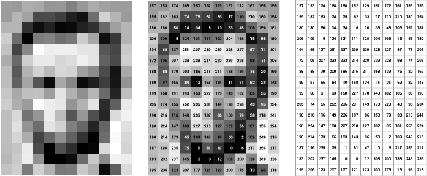

# Train webcam data with Brain.js

We'll start by converting the webcam image to an array of values. We do this by pixelating the image, so we don't get a crazy amount of values. This is done by the `analysePixelColors()` function.



Then we convert the r,g,b values to one grayscale value to reduce the amount of values further. A Neural Network works better with values from 0 to 1, so we divide the grayscale number by 255. This is all done in the `rgbToGrayscale()` function.

# Assignment

- This readme contains all necessary example code!
- Add training data to the network with the correct label after pressing each of the three training buttons.
- When you press the *TRAIN* button, train the neural network.
- After training, start a function that samples the webcam every few seconds, using `setInterval()`, and test that data against the network.
- Log only the response with the highest probability instead of the whole response object! Show this response in the HTML page as well!
- Create a more fun response. You can show an image, play a sound, or say something using the `speak()` function in `helper.js`.
- Save the trained model in a JSON file, so you don't have to train the model every time you want to classify the webcam!

# Getting started

The starter files contain all the webcam and UI code. You just have to add code that creates and trains the neural network.

## Adding training data

We will teach the network to recognise three states: an empty view, a view with a person, and a view with a waving person. First create the network and an empty data array. 

```javascript
const net = new brain.NeuralNetwork()
let trainingData = []
```
This example adds training data for a waving person. Use `analysePixelColors()` to get the webcam colors, and add a label.

```javascript
let colors = analysePixelColors()
trainingData.push({ input: colors, output: { wave: 1 } })
```
Once you trained ~20 images for each label ("wave", "person", "empty") you can train the network with the `train` function:

```javascript
net.train(trainingData)
```

## Test new data

After training, we can test the webcam input to see what label is associated with it. We will get probabilities for the labels that you supplied when training. 

```javascript
const result = net.run(analysePixelColors())
// result.wave = 0.6
// result.nobody = 0.1
// result.person = 0.3
```
You can set an interval that calls the test code every few seconds:

```javascript
intervalid = setInterval(() => classifyWebcam(), 3000)
```

## Saving and loading the trained model

You don't want to train a model every time a user starts an app. In BrainJS, you can view the trained model data as JSON, so you can save it to a file.

```javascript
var trainingData = network.toJSON()
console.log(trainingData)
```
Once you loaded data from a JSON file, you can recreate the network:
```javascript
network.fromJSON(trainingData)
```

# Links

- [BrainJS](https://brain.js.org/#/)

