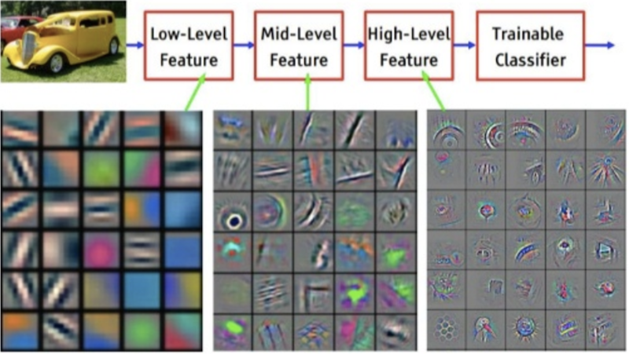

# Train the mobileNet image recognition model with your own images

In [this previous lesson](./lesson-image/readme.md) we used the trained mobileNet model to classify our images. This works for objects that the model has learned to recognise.

Using **Feature Extraction** we can re-train the model to recognise our own images!

## Feature extraction



This term means we use a model that has learned **HOW** to look at images. It finds the most important defining features. With this knowledge, it can find the distinguishing features in our own images as well.

First include ML5, and include a video tag in your html

```html
 <script src="https://unpkg.com/ml5@0.4.3/dist/ml5.min.js"></script>
 <video autoplay playsinline muted id="webcam" width="533" height="300"></video>
```
In javascript, switch on the webcam with
```javascript
if (navigator.mediaDevices.getUserMedia) {
    navigator.mediaDevices.getUserMedia({ video: true })
        .then((stream) => {
            video.srcObject = stream
        })
        .catch((err) => {
            console.log("Something went wrong!");
        });
}
```

## Training

Create the featureExtractor, and in the callback you can create the classifier. 

```javascript
const featureExtractor = ml5.featureExtractor('MobileNet', modelLoaded)
const video = document.getElementById('webcam')
function modelLoaded() {
    console.log('Model Loaded!')
    classifier = featureExtractor.classification(video, videoReady)
}
```
Create buttons for all your labels in your HTML page, and when you click a button, you can add the current webcam image with that label as a training image:
```javascript
classifier.addImage(video, 'wearing a mask', addedImage)
```
The `addedImage` callback is just to check if the image was succesfully added to the model.

### Training and classifying

After adding about 10-20 images for each label, you can call the training function. 
```javascript
classifier.train((lossValue) => {
    console.log('Loss is', lossValue)
    if(lossValue == null) console.log("Finished training")
})
```
And when training is finished, you can start an interval that checks the webcam every second!
```javascript
setInterval(()=>{
    classifier.classify(video, (err, result) => {
        if (err) console.log(err)
        console.log(result[0].label)
    })
}, 1000)
```

## Saving and loading the trained model

You don't want to `train()` a model every time a user starts an app. [Use the ML5 save and load options to load your own trained model](https://learn.ml5js.org/docs/#/reference/feature-extractor?id=save).

## Speech

You can speak the classification results!
```javascript
function speak(sentence) {
    let msg = new SpeechSynthesisUtterance()
    msg.text = sentence
    
    let selectedVoice = ""
    if (selectedVoice != "") {
        msg.voice = speechSynthesis.getVoices().filter(function (voice) { 
            return voice.name == selectedVoice; 
        })[0];
    }
    
    window.speechSynthesis.speak(msg)
}
```

## Regression

Instead of classifying an image into class A,B or C, you might want to get a value from 0 to 100. For example, to assess how damaged a car door is.

[regression](https://learn.ml5js.org/docs/#/reference/feature-extractor?id=regression) and [prediction](https://learn.ml5js.org/docs/#/reference/feature-extractor?id=predict)

# Links

- [ML5.JS](https://ml5js.org/)
- [ML5 Feature Extractor](https://learn.ml5js.org/docs/#/reference/feature-extractor)
- [MobileNet models](https://github.com/tensorflow/models/blob/master/research/slim/nets/mobilenet_v1.md)

