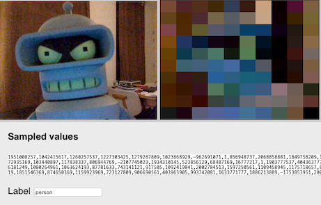

# K-Nearest-Neighbour Webcam Detection

We will classify webcam images using just K-Nearest-Neighbour

## Running the project

Open `index.html` in a `localhost` server, for example with the `live server` plugin for VS Code. 

### No editor?

You can create this project on `https://codesandbox.io`. Copy the code, or fork the example from https://codesandbox.io/s/workshop-knn-webcam-start-zsiwb

## Starter code

We need to provide the algorithm with webcam data. To do this. we draw the webcam in a canvas, so we can sample the color values of the pixels. Because even a small image of 400x300 pixels would have 120000 values, we first reduce this by pixelating the image.

Every second, the webcam image is pixelated and the color values are shown in the html page. 

## Assignment

Use the pixel color values and the label input to train the KNN algorithm in the same way as in the Cat/Dog example.

- Connect the `train` button to the KNN `train()` function with Javascript.
- For training, use the pixel data in `dataArray` and the label from the text input field.
- Change the label to what you want the algoritmh to recognise. For example "person" or "nobody".
- For each label, train ~10 images.
- Connect the `classify` button to code that calls the KNN `classify()` function on the current `dataArray` from the webcam. 

## Github documentation

https://github.com/NathanEpstein/KNear