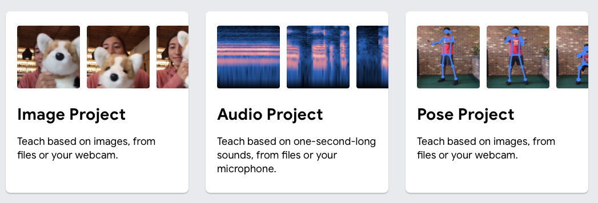
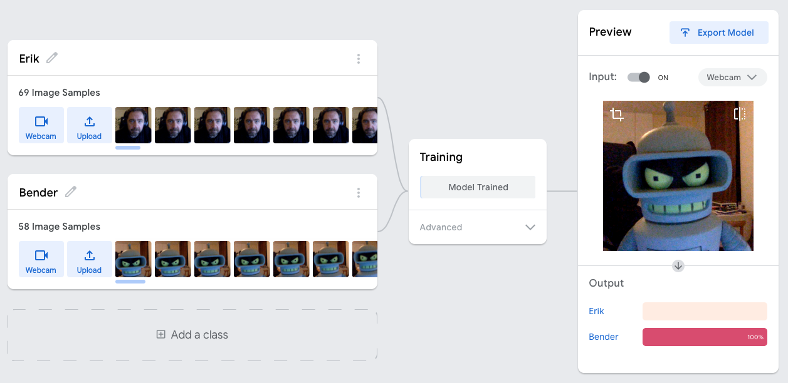
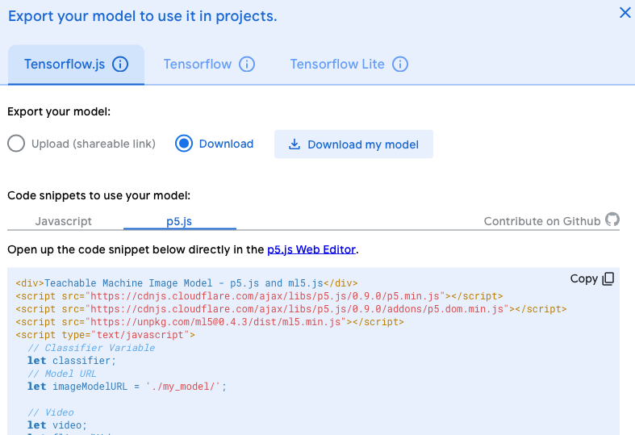
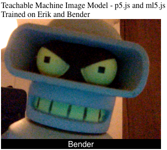

# Start a project with Teachable Machine

First, we are going to use Google's Teachable Machine to train a model. You can follow the training instructions here

https://teachablemachine.withgoogle.com/train

## Training a model

Hold the button to feed training data to the model, do this for several labels. In this case the machine learned to recognise Erik and Bender.

## Exporting and testing the model

Click export to download your model. Choose `TensorFlowJS` at the top, and download your file locally. Then click `p5.js` or `javascript` to get the javascript code for using the modal locally.

Unzip the file and make sure the name of the unzipped folder is the same as the name in the example code.

Finally, you can use your model locally!

## Connecting to your own code

Can you create a model to control your own app or game? For example, try to record voice commands for an app, or control a game using the webcam.