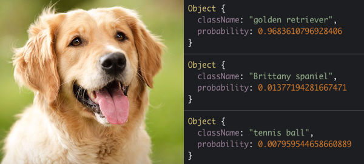

# Machine Learning Workshop

- [Introduction and reading list](../README.md)
- [Workshop part 1 - Using a pre-trained Model](./workshop1.md)
- [Workshop part 2 - Training a model](./workshop2.md)
- [Workshop part 3 - Preparing data](./workshop3.md)

# Workshop 1 - Using a pre-trained model

In this tutorial we will load a neural network library and a [pre-trained image model](https://github.com/tensorflow/models/tree/master/research/slim#pre-trained-models) in a regular HTML page.

Then we will ask the model to classify an image from the HTML page.



### Load tensorflow and model in HTML page

```
<script src="https://cdnjs.cloudflare.com/ajax/libs/tensorflow/0.12.7/tf.min.js"></script>

<script src="https://cdn.jsdelivr.net/npm/@tensorflow-models/mobilenet@0.1.1"></script>
```

### Create your app script and load it

```
<script src="app.js"></script>
```

### Place an image file in your HTML

```

```

### In app.js, tell the model to load

```
let model

async function loadModel() {
    model = await mobilenet.load()
    console.log("finished loading...")
}
```

### Pass a JPG file to the model to receive a classification

```
let img = document.getElementById("image")

async function classifyImage() {
    let predictions = await model.classify(img)
    console.log(predictions)
}
```

### A note about async functions

When a function includes the `async` and `await` keywords, the code that follows `await` will only be executed when the loading or classifying process has actually completed.

- [Complete HTML page](./files/workshop1.html)
- [Live codepen example](https://codepen.io/eerk/pen/JmKQLw)

## Speak the results out loud

It's more fun when the computer speaks what it's thinking! Can you pass the most probable result from the predictions array to the speak function?

```
function speak() {
    let msg = new SpeechSynthesisUtterance()

    msg.text = "I think this photo shows a falafel stand!"

    let selectedVoice = ""
    if (selectedVoice != "") {
        msg.voice = speechSynthesis.getVoices().filter(function (voice) { return voice.name == selectedVoice; })[0];
    }

    window.speechSynthesis.speak(msg)
}
```