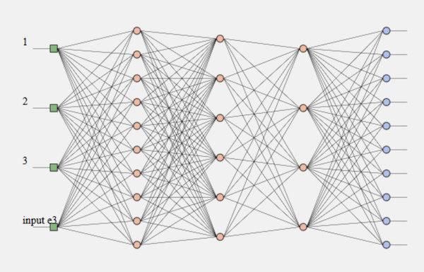

# Machine Learning Workshop

- [Introduction](./introduction.md)
- [Part 1 - Using a pre-trained Model](./workshop1.md)
- [Part 2 - Training a model](./workshop2.md)
- [Part 3 - Preparing data](./workshop3.md)
- [Reading list](../README.md)

# Workshop Part 3 - Preparing data

So far, we've used simple data to learn how to train a model. In reality, data is often complex. You will spend a lot of time preparing data before you can even start working with your neural net. For the last part of the workshop, we will convert a webcam stream into usable data.

## Application

We will teach the network to recognise three poses: an empty view, a view with a person, and a view with a waving person. After training with the live webcam, you can press the *start* button to start classifying the live webcam stream. 

## Webcam and UI

You can download the <a href="https://github.com/HR-CMGT/TLE3-machine-learning/tree/master/workshop/files" target="_blank">HTML, JS and CSS files here</a> to get started. The HTML file contains the UI. The JS file contains starter code to show a webcam stream and draw it in a canvas. 

## How to train the network

A network is trained with an array of objects. Each object contains an **array** and a **label**.

```
let trainingData = [
    { input: [0, 0, 0], output: { nobody: 1 } },
    { input: [0, 0, 1], output: { wave: 1 } },
    { input: [0, 1, 0], output: { wave: 1 } },
    { input: [1, 0, 0], output: { wave: 1 } },
    { input: [1, 1, 1], output: { person: 1 } }
]
net.train(trainingData)
```

## Test new data

When testing new data, the result will be an object that contains probabilities for the labels that you supplied when training.

```
const result = net.run([1, 0, 0])
// result.wave = 0.6
// result.nobody = 0.1
// result.person = 0.3
```

## Preparing training data from the webcam

As you can see in the [BrainJS documentation](https://github.com/BrainJS/brain.js/blob/master/README.md#training), our training data needs to contain a one-dimensional array (*a tensor*) with numbers ranging from 0-1. Example: `data = [0.11, 0.2, 1, 0.8, 0.55, 0.21]`

An image contains *rows* and *columns* of pixels. An image of 300 x 200 pixels contains 60.000 pixels. Each pixel has an r,g,b value. These r,g,b values range from 0-255. We end up with 180.000 numbers for this small image. That will make training our network slow!

## Reducing the amount of pixels

By analysing only every 10th pixel, we can reduce our amount of data to 10%. An even better idea is to simply resize the canvas to an image that is 10 by 10 pixels. That way, the pixel colors will be nicely averaged.

By reducing the image to grayscale, we can reduce the r,g,b values to one value, so now we've gone from 180.000 values to 100 values! 

# TO DO

- Create training data with the correct label after pressing one of the training buttons.
- Repeat this a number of times, until the model has been trained with enough examples for each pose.
- When you press the *run* button, start a function that samples the webcam every few seconds, using `setInterval`.
- Test that data against the network.
- Create a fun response. You can show an image, play a sound, or use [web speech](https://developer.mozilla.org/en-US/docs/Web/API/Web_Speech_API)
 to respond to the webcam. For example, when the computer recognises you, it could speak a greeting.
- Is there a way to keep r,g,b color information in one number? This would greatly improve the precision.

### Sidenote: feature detection

Our workshop network learns to recognise pixel colors. It won't recognise shapes such as eyes or faces. For more advanced image recognition you have to look at [Feature detection with BrainJS](https://scrimba.com/c/c36zkcb) or [ML5](https://ml5js.org/docs/custom-classifier), or you can take a look at [TrackingJS](https://trackingjs.com)

## Draw your network!



BrainJS has a nice [draw to SVG](https://github.com/BrainJS/brain.js/blob/master/README.md#toSVG) feature, that draws your neural net as an SVG image. You can find example code in [helper.js](./helper.js)

# Alternative projects

Learning the KNN algorithm is a good way to get started with the math behind Machine Learning:

- [K-Nearest-Neighbour in Javascript](https://github.com/NathanEpstein/KNear)
- [Webcam detector using 'K-Nearest-Neighbour'](https://github.com/KokoDoko/webcam-detectotron)

Building a single neuron is a great way to understand what really happens inside those neural networks:

- [Creating a single neuron in Javascript](https://youtu.be/o98qlvrcqiU)

When you go through the [BrainJS documentation](https://github.com/BrainJS/brain.js/blob/master/README.md) you'll find lots of fun examples to try out!

- Combine [browser speech](https://developer.mozilla.org/en-US/docs/Web/API/Web_Speech_API) with this [text-recognising example](https://github.com/bradtraversy/brainjs_examples), to create a talking machine!
- This [code](https://gist.github.com/mac2000/fc54e6d6bdcbfde28b03dc2a43611270) shows how to [recognise a hand-drawn sketch](https://output.jsbin.com/mofaduk) using BrainJS
- You could use [Johnny Five](http://johnny-five.io) to read Arduino sensor data into a BrainJS application.

# Next steps

A great next step would be to look at the [ML5 library](https://ml5js.org), which contains many examples for different types of machine learning. Perhaps you can start [teaching the computer how to draw](https://www.youtube.com/watch?v=pdaNttb7Mr8)!

The [reading list](../README.md) contains tons of links to documentation, libraries and tutorials.